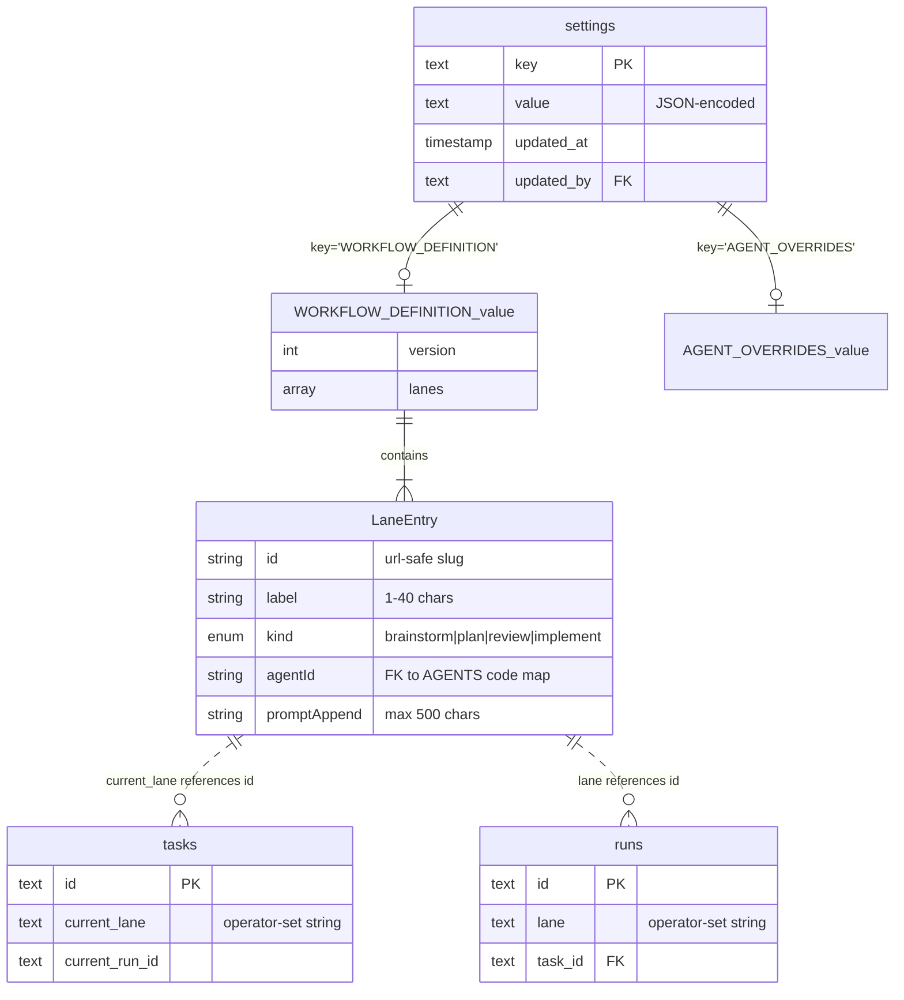

# Customizable Workflow v1 — operator-editable lanes + per-agent tuning UI

## Overview

Today the eight-lane pipeline (`ticket → branch → brainstorm → plan → review → pr → implement → done`) and the per-lane agent assignment are hardcoded across the runtime, the Board, the dashboard, and several card-detail buttons. v1 of the customizable workflow makes the **four agent-driven lanes** (`brainstorm`, `plan`, `review`, `implement`) operator-editable through `/admin/settings`, and adds a new `/admin/agents` page that exposes the existing per-agent override fields (`model`, `costWarnUsd`, `costKillUsd`, `promptAppend`) as a friendly per-row editor instead of a JSON textarea.

The intake/outcome lanes (`ticket`, `branch`, `pr`, `done`) stay hardcoded as **rails** — they represent state, not agent work. The `implement` lane is required (it produces the PR), but its agent is swappable. Operators can add new lanes (e.g. a second review lane for security), reorder open lanes, swap which agent runs in each, and append per-lane prompt context — all without restarting the server.

This is the v1 scope cut from the [2026-04-23 brainstorm](../brainstorms/2026-04-23-customizable-workflows-brainstorm.md). The bigger v2 vision (multiple named workflows, custom-agent creation, per-repo workflows) is preserved in that document and remains the long-term target; v1 ships the smallest end-to-end slice that proves the substrate works.

## Problem Statement

The CE pipeline is opinionated by design — and that opinion is the product. But "opinionated" doesn't mean "fixed for everyone forever":

- **Different teams need different gates.** A frontend repo might need an a11y review lane; a backend repo a security gate; a database PR a migration sanity check. Today the only way to add one is a code change + redeploy.
- **Agent tuning is JSON-only.** The existing `AGENT_OVERRIDES` config (cost caps, model, prompt append) is a single JSON blob in `/admin/settings` rendered as a `<textarea>`. There is no dropdown for the model, no number input for cost caps, no per-agent context. Operators avoid editing it because the failure mode of malformed JSON is the entire override layer being silently dropped.
- **The lane→agent assignment is buried in code.** `defaultAgentForLane()` is a `switch` in `server/agents/registry.ts:808-821`. To swap `ce:review` for a custom reviewer, you edit code.
- **Cross-team adoption is blocked.** Anyone installing this expects to plug in their own pipeline. "Fork the repo" is not a viable answer for the open-source story we want.

v1 fixes the four lowest-leverage frictions: edit the lane order, add/remove an open lane, swap which agent runs in a lane, and tune the per-agent fields without writing JSON.

## Proposed Solution

Three additive surfaces, no destructive changes:

1. **A `WORKFLOW_DEFINITION` settings key** (JSON blob, validated by zod, written through `setConfig` so audit logging is automatic). Single instance-wide workflow for v1; the schema is shaped so v2 can lift it into a `workflows` table without breaking the data model.
2. **A "Workflow" section in `/admin/settings`** with a drag-reorderable list of open lanes, an "Add lane" button (lane-kind picker), per-lane label / agent-dropdown / promptAppend textarea, and rails shown read-only above and below.
3. **A new `/admin/agents` page** listing the eight code-defined agents in a table; clicking a row opens a drawer with model select, cost-cap number inputs, and a promptAppend textarea. Reads + writes go through the existing `AGENT_OVERRIDES` JSON storage — no schema change.

Runtime changes are localised to four files that read the workflow on each request: the Board page, the dashboard query, `defaultAgentForLane`, and `autoAdvance`. Everything else (the worker, the run dispatcher, the artifact persister) keeps its existing API; the `lane` argument simply becomes operator-defined instead of hardcoded.

## Technical Approach

### Architecture

The new feature is a **read substrate** (one resolver function: `getWorkflow(): WorkflowDefinition`) and a **write substrate** (zod-validated save through `setConfig`). Every existing lane consumer in the codebase becomes a caller of `getWorkflow()`.

Key resolver flow:

```
getWorkflow()
  ├─ getConfig("WORKFLOW_DEFINITION") ── if DB row exists → parse + zod-validate
  │                                        └─ on parse failure → audit + fall through
  └─ DEFAULT_WORKFLOW (derived from existing LANES const, not hand-typed)
```

Write flow:

```
POST /api/admin/workflow/save
  └─ withAuth → admin-only
      └─ validateWorkflow(body)  ── enumerated invariants
          └─ setConfig("WORKFLOW_DEFINITION", json, userId)
              ├─ audit("settings.updated", {key: "WORKFLOW_DEFINITION"})
              └─ invalidate cache → next read picks up new value
```

Per-agent edit flow reuses the existing `AGENT_OVERRIDES` JSON path — the new `/admin/agents` UI is a friendlier renderer over the same storage. No new endpoint required (the existing `/api/admin/settings/save` already accepts `AGENT_OVERRIDES` as a key).

### Data model

**No new tables for v1.** One new `settings` row with key `WORKFLOW_DEFINITION` and a JSON value matching:

```typescript
// server/lib/workflowDefinition.ts (new)
const LaneKind = z.enum(["brainstorm", "plan", "review", "implement"]);

const LaneEntry = z.object({
  // url-safe slug; auto-generated from label on create, locked on edit.
  id: z.string().regex(/^[a-z0-9-]+$/).min(1).max(40),
  label: z.string().min(1).max(40),
  kind: LaneKind,
  agentId: z.string().min(1),
  promptAppend: z.string().max(500).default(""),
});

export const WorkflowDefinition = z.object({
  version: z.literal(1),
  lanes: z.array(LaneEntry).min(1),
}).superRefine((wf, ctx) => {
  // exactly one implement lane
  const implements = wf.lanes.filter(l => l.kind === "implement");
  if (implements.length !== 1) ctx.addIssue({...});
  // unique ids
  const ids = wf.lanes.map(l => l.id);
  if (new Set(ids).size !== ids.length) ctx.addIssue({...});
  // each lane's agentId must be a known agent AND that agent must declare this lane
  for (const lane of wf.lanes) {
    const agent = AGENTS[lane.agentId];
    if (!agent) ctx.addIssue({path: ["lanes", "agentId"], message: `unknown agent: ${lane.agentId}`});
    else if (!agent.lanes.includes(lane.kind)) ctx.addIssue({...});
  }
});
```

The seed default is **derived from the existing hardcoded `LANES`** at runtime, not hand-typed in the migration — eliminates the drift risk surfaced by the SpecFlow analyzer (#7 in Risks).

**No new column on `tasks` or `runs`.** The existing `tasks.current_lane` (TEXT) and `runs.lane` (TEXT) columns already accept arbitrary strings — Drizzle's `enum:` modifier is type-only, no SQL `CHECK` constraint exists (verified in `server/db/migrations/0000_watery_dazzler.sql:126`). v1 widens the TypeScript `Lane` union to `string` for the dynamic-id case while keeping `LaneKind` as the strict 4-value enum.

### Lane-kind concept (the structuring decision)

The brainstorm doesn't explicitly call this out, but it falls out of the agent-compatibility constraint: every agent declares which lanes it can serve via `AgentConfig.lanes`. If lanes can be added with arbitrary IDs, that compatibility list breaks.

**Resolution:** every lane has a `kind` (one of the four canonical kinds). When the operator adds a lane, they pick its kind first. Agent compatibility is then `agent.lanes.includes(lane.kind)`, not `agent.lanes.includes(lane.id)`. This means:
- Adding a "security-review" lane with `kind: "review"` → security:review, ce:review, perf:review all available
- Adding a "design-review" lane with `kind: "review"` → same agent pool
- Lane IDs are operator-set strings; lane kinds are constrained.

This also lets `LANE_TO_KIND` in `persistArtifacts.ts` keep its kind→artifact-kind mapping unchanged.

### ERD



Dotted associations indicate **soft references** — there is no FK enforcement. A task whose `current_lane` falls off the active workflow is "orphaned" (handled in Risks #1).

### Implementation phases

#### Phase 1: Resolver + storage (Day 1, ~6h)

**Goal:** every existing lane consumer can already call `getWorkflow()`; nothing else changes yet.

Files:
- **NEW** `server/lib/workflowDefinition.ts` — zod schema, `getWorkflow()` resolver with seed-from-LANES fallback, `validateWorkflow(input)` for save-side checks.
- `server/lib/config.ts:47-78` — add `WORKFLOW_DEFINITION` to `configSchema` (z.string with default = JSON of seed workflow).
- `server/lib/settingsSchema.ts` — add a `"workflow"` SettingSection so /admin/settings tabs can include it (or render it as a special panel — see Phase 3).
- `server/agents/registry.ts:808-821` — `defaultAgentForLane(laneId)` becomes a workflow lookup: `getWorkflow().lanes.find(l => l.id === laneId)?.agentId`. Falls back to legacy `switch` for orphan lane IDs (returns `null` instead of crashing).
- **NEW** `tests/workflowDefinition.test.ts` — zod refinements (unique ids, exactly-one-implement, unknown agent, kind-mismatch agent), default-seed equivalence to current LANES.

Acceptance:
- [ ] `getWorkflow()` returns the seed workflow when no DB row exists.
- [ ] Seed workflow's lane shape exactly equals the current `Board.tsx` `LANES` const (asserted in test).
- [ ] zod schema rejects: removing implement, duplicate ids, unknown agent, agent-kind mismatch, label > 40 chars, label empty, > 16 lanes total (sanity cap).
- [ ] `defaultAgentForLane("brainstorm")` returns `"ce:brainstorm"` (unchanged behaviour).
- [ ] `defaultAgentForLane("nonexistent")` returns `null` (no crash).

#### Phase 2: Per-agent tuning UI (Day 2, ~7h)

**Goal:** new `/admin/agents` page works end-to-end against the existing `AGENT_OVERRIDES` JSON storage. No workflow editor yet.

Files:
- **NEW** `app/(sidebar)/admin/agents/page.tsx` — server component, admin auth gate (mirror `app/(sidebar)/admin/settings/page.tsx:8-62`), reads `AGENTS` registry + `AGENT_OVERRIDES` blob, renders `<AgentsList agents={...} overrides={...} />`.
- **NEW** `components/admin/AgentsList.tsx` — table row per agent: id, label, model, cost caps. Click row → opens drawer.
- **NEW** `components/admin/AgentEditor.tsx` — drawer with `<Select model>`, `<Input number warnUsd>`, `<Input number killUsd>`, `<TextArea promptAppend max=500>`. Save via fetch to `/api/admin/settings/save` posting `{values: {AGENT_OVERRIDES: <updated-blob>}}`.
- **NEW** `components/setup/SelectInput.tsx` — first real `<select>` rendering; backfills the `select` kind that `FieldInput.tsx:91-107` currently fakes as a text input. Needed by Phase 3 too.
- `components/nav/Sidebar.tsx` — add "Agents" link under Admin section.
- **NEW** `tests/agentOverridesEditor.test.ts` — round-trip a save through the existing `handleSettingsWrite`, confirm `getAgent(id)` reflects the change.

Acceptance:
- [ ] `/admin/agents` lists all 8 agents with their effective config (base + override).
- [ ] Editing model + saving persists to `AGENT_OVERRIDES`; reload shows new value.
- [ ] Cost caps validate as positive numbers; promptAppend max 500 chars.
- [ ] Builtin agents are not deletable from the UI (no delete button).
- [ ] If `AGENT_OVERRIDES` JSON is malformed at boot, the page shows an "import error" banner and lists which agent rows fell back to defaults (per SpecFlow #5).
- [ ] Audit log records `settings.updated{key:"AGENT_OVERRIDES"}` on each save.

#### Phase 3: Workflow editor UI (Day 3, ~8h)

**Goal:** `/admin/settings` gains a "Workflow" tab with a drag-reorder + add/remove/edit-lane editor.

Files:
- **NEW** `components/admin/WorkflowEditor.tsx` — uses `@dnd-kit/react` (matching `Board.tsx:5-9` import shape):
  - Rails (`ticket`, `branch`) shown read-only at top with "fixed" chip.
  - Open lanes list — draggable rows. Each row: `<Input label>`, `<Select agentId>` (filtered by `lane.kind` against `AGENTS[id].lanes`), `<TextArea promptAppend>`, "Remove" button (disabled for implement).
  - "+ Add lane" → modal with kind picker + label input. Auto-generates id from label (slugified, deduped).
  - Rails (`pr`, `done`) shown read-only at bottom.
  - Save button calls `/api/admin/workflow/save`; rejects on 400 with the zod error mapped to the offending row.
- **NEW** `app/api/admin/workflow/save/route.ts` — `withAuth` (admin), parse body, run `validateWorkflow`, call `setConfig("WORKFLOW_DEFINITION", json, user.id)`. Return `{saved: true}` or `{error: "..."}` with 400.
- **NEW** `components/admin/WorkflowEditor/AddLaneDialog.tsx` — kind picker + label input.
- `app/(sidebar)/admin/settings/page.tsx` — add `<WorkflowEditor workflow={getWorkflow()} agents={AGENTS} />` as a new tab/section in `SettingsTabs`.
- **NEW** `tests/workflowEditor.test.ts` — round-trip save, validation rejection cases, default-seed render.

Acceptance:
- [ ] Drag-reorder open lanes; click Save; reload `/` Board reflects new order within 30s (settings cache TTL).
- [ ] Add a "security-review" lane between plan and review with `security:review` agent — appears on Board as a new column, advances correctly.
- [ ] Remove a lane that has zero in-flight tasks — succeeds; lane disappears from Board.
- [ ] Try to remove `implement` — Save button greyed out; manual API call returns 400 "exactly one implement lane required".
- [ ] Try to assign `ce:brainstorm` to a `kind:"review"` lane — agent dropdown doesn't list it; manual API call returns 400 with the offending lane.
- [ ] Per-lane promptAppend gets concatenated into the agent's effective prompt at run time (verified in Phase 4 integration test).

#### Phase 4: Lane-driven runtime + Board (Day 4, ~7h)

**Goal:** every existing hardcoded lane reference reads from `getWorkflow()`. The Board, dashboard, autoAdvance, and card-detail buttons all become workflow-aware.

Files:
- `components/board/Board.tsx:13-23, :57-67, :128, :155, :165` — accept `workflow` as a prop from the server page. Replace internal `LANES` with `workflow.lanes` (concatenated with the rails). Reset object derives from same source.
- `app/(sidebar)/page.tsx`, `app/(sidebar)/team/page.tsx` — pass `workflow={getWorkflow()}` to Board.
- `server/lib/dashboardQueries.ts:161-186` — `LANES` becomes a parameter or a `getWorkflow()` call. Throughput bucket array length matches workflow size.
- `server/worker/autoAdvance.ts:9-17, :29-73` — `NEXT` map becomes `getNextLaneId(currentLaneId, workflow)`. If currentLane not found → audit `auto_advance.orphan_lane` and no-op.
- `server/worker/spawnAgent.ts:389, :460`, `server/worker/startRun.ts:89` — replace `lane === "implement"` / `lane === "pr"` with `workflow.lanes.find(l => l.id === run.lane)?.kind === "implement"` (resp. `lane.id === "pr"` since pr is a rail).
- `server/worker/persistArtifacts.ts:26-44` — `LANE_TO_KIND` keyed by lane.id today; switch to lane.kind via `getWorkflow().lanes.find(l => l.id === laneId)?.kind`.
- `components/card-detail/RunStarter.tsx:9-12`, `ResumeBanner.tsx:11`, `ImplementButton.tsx:53-54`, `AmendPlanButton.tsx:50-51` — accept `lane: string` and resolve `agentId` via `defaultAgentForLane(lane)` rather than hardcoding. Each card's available actions derive from `workflow.lanes`.
- **NEW** `components/board/OrphanLaneSection.tsx` — when any task's `current_lane` ∉ `workflow.lanes`, render a dimmed "Orphaned" pseudo-column with a one-click "move to <first valid lane>" action per task (per SpecFlow #1).
- **NEW** integration test `tests/workflowIntegration.test.ts` — change workflow → confirm Board renders new lanes → start a run on the new lane → confirm artifact persisted under correct kind → confirm autoAdvance moves to next lane.

Acceptance:
- [ ] All hardcoded lane string-checks (`lane === "X"`) outside of rails replaced with workflow lookups.
- [ ] Existing tasks (with current_lane in the original 4 IDs) continue to advance correctly.
- [ ] Tasks whose `current_lane` no longer exists in workflow appear in the Orphan column with a "move to ..." button.
- [ ] In-flight runs targeting a removed lane finish (don't kill them mid-stream); audit log notes the lane is no longer in workflow.
- [ ] Board renders within ~50ms after workflow change (one extra getConfig hit, cached 30s).

#### Phase 5: Polish, migration, documentation (Day 5, ~5h)

**Goal:** ship-ready. Migration of existing AGENT_OVERRIDES happens here (it's a one-line "verify it parses, log import errors, fall back per-agent" — the storage shape is unchanged).

Files:
- `server/lib/agentOverrides.ts` (might already exist as part of registry.ts) — wrap the JSON parse in try-catch per-agent-key per SpecFlow #5; record errors to a new `agent_override_import_errors` settings key for the banner to surface.
- `docs/install-checklist.md` — note the new `/admin/agents` page in the post-setup section.
- `docs/runbooks/customizing-the-workflow.md` (new) — short runbook: how to add a security-review lane, how to wire a custom agent (link forward to v2 design), how to recover from a broken save.
- `README.md` — mention "/admin/settings → Workflow tab" and "/admin/agents" in the Pages section.
- Delete the `AGENT_OVERRIDES` raw textarea from `settingsSchema.ts` agents section (or keep behind an "advanced" toggle for power users).
- E2E smoke test: `scripts/smoke-workflow.sh` — boot fresh DB, change workflow via API, start a task on the new pipeline, assert PR opens.

Acceptance:
- [ ] Every brainstorm acceptance criterion is met.
- [ ] No regressions in existing test suite (currently 58 tests, target ≥ 70 after this work).
- [ ] Smoke test passes end-to-end.
- [ ] README + install checklist updated.
- [ ] Audit log shows `settings.updated` entries for both workflow + agent edits.

## Alternative Approaches Considered

### A. JSON blob in `settings` table (CHOSEN for v1)

- **Pros:** zero new tables, audit-log-for-free via `setConfig`, atomic save semantics, settings cache works unchanged, trivial v2 migration (when we lift to a `workflows` table, just `INSERT … SELECT` from the JSON blob).
- **Cons:** can't query lanes from SQL (e.g. "find tasks in lane X"), JSON doesn't get foreign-key integrity, no schema migration on field changes — relies on zod refinement.
- **Why chosen:** v1 has exactly one workflow. Tables are over-engineering at this scale.

### B. Dedicated `workflows` + `lanes` tables (deferred to v2)

- Lifts the JSON shape into proper tables. Required when v2 adds named workflows + per-repo selection.
- Skipped now because it adds two migrations + an entire repository layer for one row of data.

### C. Per-agent settings table instead of `AGENT_OVERRIDES` JSON

- Considered for Phase 2: could replace the `AGENT_OVERRIDES` blob with an `agent_overrides` table keyed by agent_id.
- **Skipped:** the JSON shape works, has a getEffectiveAgent merge already, and migrating to a table would mean rewriting `getAgent()` resolver (`server/agents/registry.ts:743-806`) which has subtle user-vs-instance precedence semantics. Out of scope for v1.

### D. Repo-file-based workflow (`.aiops/workflow.yaml`)

- Considered in the brainstorm phase as the "infra-as-code" alternative. User explicitly chose DB-backed UI.
- Reasons: easier for non-devs, single source of truth in one DB, no per-repo file churn.
- **Trade-off accepted:** workflow not git-versioned, not portable across instances. Audit log + DB backup are the rollback story.

## System-Wide Impact

### Interaction Graph

When an admin saves a new workflow:

1. Browser POSTs `/api/admin/workflow/save` with `{lanes: [...]}`
2. `withAuth` checks session → role === "admin" → 403 if not
3. `validateWorkflow(body)` runs zod refinements → returns 400 with field paths if rejected
4. `setConfig("WORKFLOW_DEFINITION", json, user.id)` writes the row
5. → `audit({action: "settings.updated", actorUserId, payload: {key: "WORKFLOW_DEFINITION"}})` fires automatically
6. → cache invalidator deletes the cached value
7. Client gets `{saved: true}` → router.refresh() → Board re-renders with new lanes within the cache TTL window
8. Existing in-flight runs are unaffected (their stream parser doesn't read workflow definition)
9. **Next** auto-advance call for any run reads the new workflow → progresses to the new next-lane

When a run completes on a custom-added "security-review" lane:

1. `spawnAgent.finalize()` writes status=completed, calls `maybeAutoAdvance(runId)`
2. `getNextLaneId("security-review", workflow)` returns the next lane in workflow order
3. If that's `review` → `startRun({lane: "review", agentId: defaultAgentForLane("review")})`
4. New run begins; existing artifact pipeline persists output under `docs/reviews/<jira>-review.md`

### Error & Failure Propagation

| Failure | Propagates to | Behaviour |
|---|---|---|
| zod validation rejects save | API route | 400 with field path; UI maps to row-level red border |
| `setConfig` throws (DB locked) | API route | 500; UI shows toast; DB unchanged |
| `getWorkflow()` parse failure (corrupt blob) | every consumer | audit `workflow.import_failure`, fall through to seed default; banner on /admin/settings |
| `getNextLaneId` returns null (orphan) | autoAdvance | audit `auto_advance.orphan_lane`, no-op silently (matches existing behaviour for unknown lanes at `autoAdvance.ts:35`) |
| Agent referenced by lane is removed from registry (registry.ts edit + redeploy) | `getAgent(id)` returns null | spawnAgent fails fast on missing agent; surfaced as run error; admin must edit workflow to swap agent |
| `AGENT_OVERRIDES` JSON malformed at boot | `getAgent` resolver | each per-agent key parsed in try/catch; failed keys fall back to base config; banner on /admin/agents lists offenders (per SpecFlow #5) |

### State Lifecycle Risks

The biggest risk surface is `tasks.current_lane` and `runs.lane` becoming stale references. Concrete scenarios:

| Scenario | Today | After v1 |
|---|---|---|
| Task on lane X, admin removes lane X | N/A (can't happen) | Task appears in Orphan column with "move to ..." action; auto-advance no-ops on this lane |
| Run in-flight on lane X, admin removes lane X | N/A | Run continues to completion; artifact persisted with `kind: "review"` (or whatever the lane's last-known kind was); auto-advance reads the *new* workflow and either skips to next or no-ops |
| Workflow saved with two lanes having id="review" | N/A | zod rejects at save time; never persisted |
| Two admins simultaneously save different workflows | N/A | last-write-wins (acceptable for v1; v2 adds optimistic-lock per SpecFlow #3) |
| Existing AGENT_OVERRIDES has unknown agent id (registry was renamed) | Silently ignored in current resolver | Same — `getAgent("ghost:agent")` returns null, run fails fast at spawn |

**Key invariant preserved:** the `tasks.current_lane` column never contains values the operator didn't intend. Stale values only happen if the operator removes a lane from the workflow — which the UI warns about ("3 in-flight tasks on this lane") before allowing remove.

### API surface parity

| Surface | Currently | After v1 |
|---|---|---|
| `/admin/settings` form save | `/api/admin/settings/save` accepting `AGENT_OVERRIDES` blob | Same; new `/api/admin/workflow/save` for workflow blob |
| `/admin/agents` page | did not exist | New; reads + writes `AGENT_OVERRIDES` (uses existing `/api/admin/settings/save`) |
| `getAgent(id)` callers | unchanged | unchanged — resolver still merges base + AGENT_OVERRIDES + user prefs |
| Board / cards | hardcoded LANES const | Reads `getWorkflow()` server-side, passes as prop |
| `defaultAgentForLane(lane)` callers | switch statement | workflow lookup; null-safe |
| Programmatic API (any future external API) | does not exist | not added in v1; would be a v2 concern |

### Integration Test Scenarios

Five cross-layer scenarios that unit tests with mocks would never catch. Each becomes a vitest case in `tests/workflowIntegration.test.ts`:

1. **Add a lane and run a task end-to-end.** Save workflow with a new "security-review" lane between plan and review (agent: security:review). Create a task, run brainstorm → plan, then trigger security-review run. Assert: artifact persists at `docs/reviews/<jira>-security-review.md`, status transitions correctly, autoAdvance progresses to standard `review`.
2. **Remove a lane mid-task.** Task is sitting on `review`. Admin removes the `review` lane. Reload the Board. Assert: task appears in Orphan column with "Move to implement" button; clicking it advances cleanly; subsequent runs target `implement`.
3. **Reorder lanes.** Move `review` before `plan`. Existing tasks: those on `plan` should auto-advance to `review` next (per new order); those on `review` should auto-advance to `implement`. Assert order respected.
4. **Per-lane prompt-append composition.** Set lane `review.promptAppend = "Pay extra attention to SQL injection."` Trigger a review run. Assert the rendered prompt contains that string under the `## Operator notes` section (composed below `agent.promptAppend`).
5. **Validation rejection round-trip.** POST a workflow with two implement lanes → 400 with `lanes[2].kind` field path. POST one with agent ce:brainstorm assigned to a review-kind lane → 400 with descriptive message.

## Acceptance Criteria

### Functional Requirements

- [ ] `/admin/settings` has a "Workflow" tab with the rails shown read-only and the four open lanes shown as drag-reorderable rows.
- [ ] Each open lane row exposes: label (text), agent (select filtered by lane.kind), promptAppend (textarea, max 500 chars), Remove button (disabled when kind=implement and only one implement lane exists).
- [ ] "Add lane" opens a dialog with kind picker (4 options) and label input; auto-generates a unique slug id.
- [ ] `/admin/agents` is a new admin page listing the 8 code-defined agents in a table.
- [ ] Clicking an agent row opens a drawer with: model (select), warnUsd (number), killUsd (number), promptAppend (textarea).
- [ ] Saving any change updates `AGENT_OVERRIDES`; the next run picks up the new value (verified by `getAgent` returning merged config).
- [ ] No "Create agent" button anywhere; the 8 builtin agents are the only options.
- [ ] Board, dashboard throughput query, autoAdvance, and card-detail action buttons all read lanes from `getWorkflow()`.
- [ ] Existing tasks (created before this feature shipped) continue to work unchanged.

### Non-Functional Requirements

- [ ] Adding 1 extra `getConfig("WORKFLOW_DEFINITION")` per request; expected impact: 0 extra DB reads (already cached 30s) + ~50µs JSON parse.
- [ ] No new external dependencies (dnd-kit, zod already in package.json).
- [ ] No DB migration (settings table holds the JSON; existing schema accommodates).
- [ ] Bundle size impact: the WorkflowEditor + AgentEditor add ~5KB gzipped to the admin route group (lazy-loaded).
- [ ] Audit log entries for every save (workflow + agent) — writable by `setConfig`.

### Quality Gates

- [ ] All existing 58 vitest tests still green.
- [ ] At least 12 new tests across: zod validation, workflow integration, agent overrides round-trip, orphan lane handling, autoAdvance with custom lanes.
- [ ] `npm run typecheck`, `npm run lint`, `npm run build` all clean.
- [ ] One smoke test (`scripts/smoke-workflow.sh`) that exercises the full create-workflow → run-task → assert-PR flow on a fresh DB.
- [ ] README + install checklist updated with the two new admin surfaces.

## Success Metrics

- **Adoption signal:** within 30 days of ship, ≥ 1 admin has saved a non-default workflow on the production instance (audit log query: `SELECT count(*) FROM audit_log WHERE action='settings.updated' AND payload_json LIKE '%WORKFLOW_DEFINITION%'`).
- **Operator self-service:** zero requests to "add a security review step" or "swap the reviewer agent" come back to engineering after this ships.
- **Stability:** zero `auto_advance.orphan_lane` audits in normal operation. Spikes correlate with workflow edits (expected); persistent orphans indicate a bug.
- **Per-agent tuning use:** at least one of the four `AGENT_OVERRIDES` fields (model, warnUsd, killUsd, promptAppend) is non-default for ≥ 2 agents within 30 days.

## Dependencies & Prerequisites

**External (none new):**
- `@dnd-kit/react` — already in package.json, used by Board.
- `zod` — already used everywhere.

**Internal:**
- `server/lib/config.ts` `setConfig`/`getConfig` substrate — already shipped.
- `server/lib/settingsWrite.ts` `handleSettingsWrite` — already shipped.
- `getAgent(id, {userId})` resolver — already merges AGENT_OVERRIDES correctly.
- `withAuth` middleware (admin gate) — already shipped (`app/api/admin/settings/save/route.ts:14-19`).
- `SettingsTabs` component — already shipped (`components/admin/SettingsTabs.tsx`).

**Blocking:** none. Everything builds on existing substrate.

## Risk Analysis & Mitigation

These eight risks combine my analysis with the SpecFlow analyzer output. Each has a concrete mitigation in the implementation phases above.

| # | Risk | Mitigation | Phase |
|---|---|---|---|
| 1 | **Cards stranded in deleted lanes — invisible on Board.** Operator removes a lane, in-flight tasks become unreachable. | Render an "Orphaned" pseudo-column on the Board whenever any task's `current_lane` ∉ workflow.lanes. Per-card "Move to <first valid lane>" action. | Phase 4 |
| 2 | **In-flight run on a lane being removed.** Admin removes lane X while a run is streaming into it; artifact + cost meter keep going. | Save handler checks `runs WHERE status='active' AND lane IN (lanes-being-removed)`. If hits, return 409 with the list — UI prompts "Cancel N runs and remove?" Confirming SIGINTs them via existing `kill-run` route, then commits the workflow change. | Phase 3 |
| 3 | **Concurrent admin saves clobber.** Two admins save different workflows simultaneously; last write silently wins. | v1: accept last-write-wins; document in runbook. v2: add `version` field to workflow, 409 on stale save. (SpecFlow #3 deferred consciously.) | Future |
| 4 | **Lane-agent compatibility bypass.** Programmatic POST or stale client could pair an incompatible agent with a lane. | Server-side `validateWorkflow` enforces `agent.lanes.includes(lane.kind)`. Client filter is UX-only. | Phase 1 |
| 5 | **Malformed `AGENT_OVERRIDES` import.** Existing JSON could be corrupt or reference retired models. | Per-agent-key try/catch in resolver; record offenders to `agent_override_import_errors` settings key; banner on `/admin/agents` listing them. | Phase 5 |
| 6 | **Validation gates too thin.** Brainstorm names only "remove implement / break state machine"; many other invariants matter. | Single `validateWorkflow()` function enumerates: unique ids, exactly-one-implement, agent exists, agent.lanes.includes(kind), label 1–40 chars, slug regex, ≤ 16 lanes (sanity cap), no rails in operator-editable list. | Phase 1 |
| 7 | **Default-workflow seed drift.** Hand-typed default could diverge from current hardcoded LANES; in-flight tasks land on subtly different pipeline. | Seed is **derived at runtime** from a shared `LANES_SEED` constant — same constant Board.tsx imports. Test asserts equivalence. | Phase 1 |
| 8 | **Board read-permission gap.** Admin-only writes are stated; reads must be member-readable for the Board to render. | `getWorkflow()` is a pure server function, no auth check. Only the **save** endpoint is admin-gated. Board (member-visible) can call it freely. | Phase 4 |

Two additional risks I want to flag explicitly:

- **Drizzle enum widening assumption.** I verified `tasks.current_lane` has no SQL CHECK constraint (raw migration file inspected). If a future migration adds one, dynamic lane IDs would start failing inserts. Add a comment in `server/db/schema.ts` saying "this enum is type-only by design — see workflow customization plan."
- **Performance of getWorkflow() on every Board render.** Cached 30s via the existing settings cache. Worst case is ~50µs JSON parse. If this ever becomes a hot path, hoist into a module-level memoized resolver — not needed at v1 traffic.

## Resource Requirements

**Engineering:** ~5 days of focused single-engineer work, broken down per phase. No design dependency (matches existing /admin/settings + Board visual language). No infra changes.

**Testing:** ~1 day of the 5-day budget for new tests + smoke. Existing test suite is the safety net — every refactored hardcoded lane string must keep passing.

**Documentation:** ~2 hours for the runbook + README updates (folded into Phase 5).

## Future Considerations

**v2 path (preserved from brainstorm):**
- Multiple named workflows + ticket-time picker
- Custom agent creation (prompt template editor + tool sandbox)
- Per-repo workflows (after a repo registry lands)
- Optimistic locking for concurrent edits (SpecFlow #3)
- Workflow JSON export/import for portability

**v1 → v2 migration shape:** the `WORKFLOW_DEFINITION` blob's schema (`{version: 1, lanes: [...]}`) is shaped to allow `{version: 2, workflows: [{id, name, lanes: [...]}]}` without breaking existing readers. The migration is `INSERT INTO workflows SELECT … FROM (parsed JSON)` — a one-line lift.

**Out of scope for v1, explicitly:**
- Tool sandboxing per agent
- Branching / DAG / conditional routing
- Workflow JSON export/import
- Visual drag-and-drop with arrows (the current list UI is the v1 affordance)
- Per-team or per-user workflow overrides

## Documentation Plan

| Doc | Change |
|---|---|
| `README.md` | Add `/admin/agents` to Pages section; add note about Workflow tab in `/admin/settings`. |
| `docs/install-checklist.md` | Mention the two new admin surfaces in step 6 (post-setup verification). |
| `docs/runbooks/customizing-the-workflow.md` (NEW) | Step-by-step: how to add a security-review lane, how to swap the reviewer, how to recover from a corrupt workflow blob. |
| `docs/brainstorms/2026-04-23-customizable-workflows-brainstorm.md` | Add a "Resolved in v1 plan" link at the top once this plan is implemented. |
| Code comments in `server/lib/workflowDefinition.ts` | Explain the lane-kind concept and why it exists. |
| Code comment in `server/db/schema.ts` near `current_lane` | "Type-only enum by design — see customizable workflow plan." |

## Sources & References

### Origin

- **Brainstorm document:** [docs/brainstorms/2026-04-23-customizable-workflows-brainstorm.md](../brainstorms/2026-04-23-customizable-workflows-brainstorm.md). Key decisions carried forward:
  - Single instance-wide workflow (v1 cut from "unlimited named workflows")
  - DB-backed admin UI (vs. repo-file workflow.yaml or hybrid)
  - Rails fixed (ticket/branch/pr/done); open lanes are brainstorm/plan/review/implement; implement required, agent swappable
  - View+tune existing 8 agents in /admin/agents; no custom agent creation in v1

### Internal references

- Admin page conventions: `app/(sidebar)/admin/settings/page.tsx:8-62`, `app/(sidebar)/admin/ops/page.tsx:36-48`
- Settings tabs: `components/admin/SettingsTabs.tsx:20-93`
- Settings write substrate: `server/lib/settingsWrite.ts:43-67`, `server/lib/config.ts:166-198`
- Effective-agent resolver: `server/agents/registry.ts:743-806` (`getAgent(id, {userId})`)
- Per-agent override fields: `server/agents/registry.ts:715-727` (`AgentOverrideFields`)
- Hardcoded lanes: `server/agents/registry.ts:10` (Lane type), `components/board/Board.tsx:13-23`, `server/lib/dashboardQueries.ts:161-186`, `server/worker/persistArtifacts.ts:26-44`, `server/worker/autoAdvance.ts:9-17,29-73`
- Lane-special-cased worker code: `server/worker/spawnAgent.ts:389,460`, `server/worker/startRun.ts:89`
- Card-detail buttons: `components/card-detail/RunStarter.tsx:9-12`, `ResumeBanner.tsx:11`, `ImplementButton.tsx:53-54`, `AmendPlanButton.tsx:50-51`
- Form-input conventions: `components/setup/FieldInput.tsx:42-108` (note: `select` kind currently fakes as text input — Phase 2 adds real `SelectInput`)
- dnd-kit usage pattern: `components/board/Board.tsx:5-9,117-128,203,254-257` (uses `@dnd-kit/react` v2 API)
- Tasks schema: `server/db/schema.ts:75-117` (no SQL CHECK on current_lane)
- Migrations: `server/db/migrations/0000_watery_dazzler.sql:126`, latest is `0002_*`

### External references

- Auth.js v5 admin guard pattern (already in use; no new docs needed)
- Drizzle ORM `text({enum: [...]})` semantics — type-only, no SQL check (verified in this codebase)

### Related work

- Brainstorm: [docs/brainstorms/2026-04-23-customizable-workflows-brainstorm.md](../brainstorms/2026-04-23-customizable-workflows-brainstorm.md)
- Wizard hardening (just shipped, sets the pattern for `setConfig`-based admin saves): commit `b80e131` and `aea07da` on `main`
