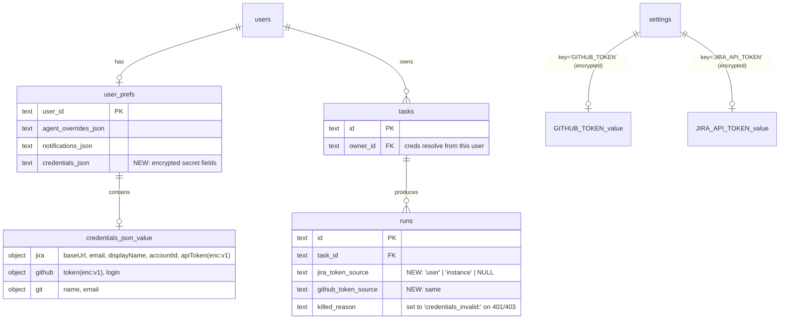

# Per-User Token Configuration with Instance Fallback

## Overview

Today every Jira read/write and every GitHub push/PR-open shares one
set of credentials configured in `/admin/settings` (Jira) or
`process.env` (GitHub). That single identity is the box's identity in
Atlassian's audit trail and on GitHub PRs — even when ten different
users are kicking off runs from the swimlane UI.

This feature lets each user configure their own Jira credentials,
GitHub PAT, and git author identity on `/profile`. At runtime, the
**task creator's** tokens are used; if they haven't set them, the
worker silently falls back to the instance defaults already configured
in `/admin/settings`. Tokens stored encrypted-at-rest with AES-256-GCM
keyed off `AUTH_SECRET` via HKDF (or an explicit `TOKEN_ENCRYPTION_KEY`
when an operator wants to rotate independently of `AUTH_SECRET`).

The feature is additive: users who never visit `/profile` continue to
work exactly as today. The substrate (`user_prefs.agentOverrides`
overlay pattern, `getAgent(id, {userId})` resolver,
`server/lib/settingsTestActions.ts`'s test endpoints) already exists —
this plan is mostly a duplication of those patterns plus one new
encryption helper module.

(Origin: see [docs/brainstorms/2026-04-26-per-user-tokens-brainstorm.md](../brainstorms/2026-04-26-per-user-tokens-brainstorm.md).)

## Updates from technical review (v2, 2026-04-26)

The v1 draft of this plan was reviewed by `security-sentinel`,
`kieran-typescript-reviewer`, and `architecture-strategist`. All four
clusters of feedback are folded into this version:

**Security blockers (all addressed):**
- AAD now binds `userId + fieldPath` (was userId only) — prevents intra-row ciphertext swap (e.g. `jira.apiToken` → `github.token`).
- `credentials.set` audit records `tokenFingerprint = sha256(token).slice(0,16)` — operator forensics without storing the token.
- `credentials.tested` audit records `outcome` + `from_ip`.
- Lockout after 5 consecutive Test failures per `(userId, service)` in 1h, on top of rate limit (OWASP ASVS V11.1.2).
- CSRF defense: verify `Origin` header on every `/api/profile/credentials/*` POST/DELETE.
- Redaction pass on all error messages bubbling from `jira/client.ts` / `git/approve.ts` into audit/UI.
- Boot-migration wraps each key in `BEGIN IMMEDIATE` to prevent TOCTOU races.

**Type-safety hardening (all addressed):**
- Branded `Ciphertext` / `Plaintext` types — DB read returns `Ciphertext`; only `decrypt()` produces `Plaintext`. "Forgot to encrypt" becomes a compile error.
- `resolveCredentials<S>(userId, service)` returns a discriminated union `{service, source: 'user'|'instance'|'missing', value}` — no nullable values + sidecar `sources` map.
- `JiraClient` and `GithubClient` classes instead of free functions taking `creds` as first arg — single creds binding per logical operation.
- Disk vs memory zod schemas (`JiraDisk` / `JiraMem`) — asymmetric types catch encryption regressions.
- `parseEnvelope(s) → Result<...>` instead of `isCiphertext(s): boolean` — typed errors distinguish "wrong prefix" from "corrupt envelope."
- Failure reasons as template literal types: `\`credentials_invalid:${ServiceKey}\``.

**Architectural restructuring (all addressed):**
- `credentialCrypto.ts` → renamed `server/lib/encryption.ts`. AAD passed by caller, not baked into primitive — future encrypted-at-rest features (webhook secrets, OAuth refresh) reuse it.
- Resolver moved from `server/lib/credentials.ts` → `server/integrations/credentials.ts` — natural home for future Slack/Linear/Anthropic resolvers.
- First-boot encryption migration moved out of `instrumentation.ts` → `scripts/migrate-instance-secrets.ts` standalone runner invoked from `npm run db:migrate`.
- `runs.tokenSourceJson` blob → flat columns `runs.jira_token_source` / `runs.github_token_source` (queryable, indexable).
- Test endpoints follow existing dynamic-segment pattern: `/api/profile/credentials/test/[service]/route.ts` (not monolithic).
- Test handlers live in `server/lib/userCredentialsTestActions.ts` and return the existing `{ok, message, details}` shape.
- Rate limiter uses existing `server/lib/rateLimit.ts` substrate.

**Process improvements:**
- `/admin/users` page existence resolved up front (Phase 0, see below) — page is created if missing.
- Resolver-pattern ADR added: `docs/adrs/0001-resolver-pattern.md` documenting the overlay+sources+lazy-require contract for future per-user features.
- Phase 3 refactor estimate bumped from 10h → 14h (review flagged hidden call sites: `_myselfPromise` cache plus Claude-tool-call inheritance of `JIRA_*` env vars in spawned subprocesses).
- Total estimate: ~8 days (was ~7).
- Acceptance criteria include explicit grep checks for residual `env.JIRA_*` / `process.env.GITHUB_TOKEN` reads.

## Problem Statement

Three concrete pains, in order of severity:

1. **Audit trail collapses to one identity.** Every Jira comment that
   the orchestrator posts (status transitions, PR-opened comments, AI
   review summaries) shows the box's Atlassian account as the author —
   not the user who created the ticket. Same for git commits
   (currently hardcoded `ai-ops@multiportal.io / lawstack-aiops` at
   `server/git/approve.ts:148-152`) and GitHub PR-author identity (the
   shared `GH_TOKEN`). For any team larger than one, "who actually
   shipped this?" is unanswerable from external systems.

2. **Cost and rate-limit pooling.** The instance Anthropic/Atlassian
   identity bears the entire org's cost meter and rate limits. There's
   no way for a power user to opt into spending their own budget so a
   noisy neighbour doesn't starve them out. (Anthropic-key per-user is
   explicitly out of scope for v1 — this plan addresses Jira and
   GitHub only — but the substrate it lays down is the same one v2
   would use.)

3. **Onboarding friction for self-hosters.** The expected pattern for
   a self-hostable open-source orchestrator in 2026 is "I configure
   my keys, you configure yours, the box doesn't need a god account."
   Today the box needs an Atlassian account with full access to every
   project anyone might want to work in. That's a non-starter for any
   org with project-level ACLs.

## Proposed Solution

Six additive surfaces, no destructive changes:

1. **A new generic encryption primitive** —
   `server/lib/encryption.ts` exposes typed `encrypt(plaintext, aad) → Ciphertext`
   and `decrypt(ciphertext, aad) → Plaintext` using AES-256-GCM with a
   key derived from `AUTH_SECRET` via HKDF-SHA256 (or
   `TOKEN_ENCRYPTION_KEY` if set). 96-bit random IV per row, AAD
   passed by caller (callers compose `userId + fieldPath` to bind both
   user identity and field position into the auth tag — see Risk #3
   and §Encryption envelope).

2. **Schema delta** — one new TEXT column on `user_prefs` and two
   new TEXT columns on `runs`:
   - `user_prefs.credentials_json TEXT NOT NULL DEFAULT '{}'` — JSON
     blob whose secret subfields are stored as `enc:v1:` envelopes.
   - `runs.jira_token_source TEXT` — values `'user'|'instance'|null`.
   - `runs.github_token_source TEXT` — same.

3. **A typed resolver: `resolveCredentials<S>(userId, service)`** —
   discriminated-union return parameterized by service. Same lazy-
   require + safeParse + try/catch pattern as `getAgent(id, {userId})`
   at `server/agents/registry.ts:743-806`. Lives in
   `server/integrations/credentials.ts` to leave room for future
   service resolvers (Slack, Linear, Anthropic).

4. **Refactor of every token-read call site** to thread `RunContext`
   carrying snapshotted creds. Wraps Jira and GitHub access in
   `JiraClient` / `GithubClient` classes constructed from the
   context's creds — one binding per logical operation. The
   `RunContext`'s userId is the **task creator** (`tasks.ownerId`),
   resolved once at run start.

5. **A `/profile` "Connections" section** with three cards (Jira,
   GitHub, Git identity) and test-before-save flow. Backed by
   dynamic-segment API routes mirroring the existing admin pattern:
   `POST /api/profile/credentials/test/[service]/route.ts` and
   `POST /api/profile/credentials/save/[service]/route.ts`. CSRF
   origin checks on every state-changing route.

6. **Promotion of `GITHUB_TOKEN` from env-only to `settings`.** Adds a
   row to `configSchema` mirroring `JIRA_API_TOKEN`. A separate
   migration runner (`scripts/migrate-instance-secrets.ts`, invoked
   from `npm run db:migrate`) encrypts existing plaintext values and
   bootstraps `GITHUB_TOKEN` from env into settings on first run.
   Each key migrated inside its own `BEGIN IMMEDIATE` transaction.

Rails not touched: `tasks.ownerId` already exists (`server/db/schema.ts:82-84`),
auth substrate already passes `session.user.id` everywhere, audit log
already supports the action namespace we'll use, `NOTIFY_ACTIONS`
already includes `run.failed` so token-failure notifications come for
free.

## Technical Approach

### Architecture

The feature is **two new substrates** plus **one resolver** plus
**one UI surface** plus **one refactor sweep**:

- **Substrate A — `server/lib/encryption.ts`** — pure module, zero
  dependencies on app state. Inputs: plaintext + AAD. Output:
  `Ciphertext` (a branded `string` type holding
  `enc:v1:<base64url(iv ‖ ciphertext ‖ tag)>`). Internals load the
  AES key once at first call (lazy, not module-init — so tests
  don't fail to import on missing env), fail fast if neither
  `TOKEN_ENCRYPTION_KEY` nor `AUTH_SECRET` is set.

- **Substrate B — `credentials_json` column + token-source columns**
  — pure storage, written via existing `userPrefs.ts` write helper
  extended with a third field. Disk-shape uses `Ciphertext` for
  secret subfields; memory-shape (post-`readUserPrefs` decryption)
  uses `Plaintext`. Asymmetric zod schemas catch "forgot to
  encrypt" at compile time.

- **Resolver — `resolveCredentials<S>(userId, service)`** —
  discriminated union over user/instance/missing. Lives in
  `server/integrations/credentials.ts`.

- **UI — `/profile` Connections section** — three React cards, each
  with input + test button + save button. Mirrors `/admin/settings`
  visual language (the existing `SettingsTabs` component).

- **Refactor sweep** — every Jira/GitHub call site moves from
  `env.X`-reading to `JiraClient(creds)` / `GithubClient(creds)`
  instantiated from `RunContext`. Single creds binding per logical
  operation.

#### Encryption envelope

Per [NIST SP 800-38D](https://nvlpubs.nist.gov/nistpubs/legacy/sp/nistspecialpublication800-38d.pdf)
§5.2.1.1 (96-bit IVs are recommended for AES-GCM), and
[RFC 5869](https://datatracker.ietf.org/doc/html/rfc5869) §3.1–3.2 for
HKDF parameters:

```
Format:        "enc:v1:" + base64url(IV ‖ CIPHERTEXT ‖ TAG)
IV:            12 random bytes (crypto.randomBytes(12))
TAG:           16 bytes (default for aes-256-gcm)
Cipher:        AES-256-GCM
AAD:           "user_prefs:tokens:v1:" + userId + ":" + fieldPath
                 e.g. "user_prefs:tokens:v1:U_abc:jira.apiToken"
                 (fieldPath binding prevents intra-row swap — see Risk #3)
Key:           HKDF-SHA256(IKM=AUTH_SECRET, salt=K_SALT, info=K_INFO, len=32)
                 unless TOKEN_ENCRYPTION_KEY is set, in which case
                 base64.decode(TOKEN_ENCRYPTION_KEY) → 32-byte key directly
K_SALT:        sha256("aiops.token-encryption.v1") — committed constant
K_INFO:        "aiops:user_prefs:tokens:aes-256-gcm:v1"
```

The `:v1:` prefix is the rotation lever — when we ever bump algorithms
or rotate keys, `v2` decoders run alongside `v1` decoders during the
re-encryption window. AAD-binding to `userId + fieldPath` means an
attacker with DB-write access cannot swap user A's ciphertext into
user B's row, NOR move user A's `jira.apiToken` ciphertext into
user A's `github.token` field — both attacks fail GCM auth-tag
verification.

**Boot-time entropy invariant:** `encryption.ts` asserts at first
call that `Buffer.byteLength(AUTH_SECRET, 'utf8') >= 32`
([NIST SP 800-133](https://csrc.nist.gov/pubs/sp/800/133/r2/final) §6.2
considers 128-bit-effective-entropy IKM acceptable for HKDF).

#### TypeScript shapes

Public surface, with branded types preventing footgun substitutions:

```typescript
// server/lib/encryption.ts
export type Ciphertext = string & { readonly __brand: 'enc:v1' };
export type Plaintext  = string & { readonly __brand: 'plaintext' };

export function encrypt(p: Plaintext, aad: string): Ciphertext;
export function decrypt(c: Ciphertext, aad: string): Plaintext;
export function asPlaintext(s: string): Plaintext;        // construct from raw input
export function parseEnvelope(s: string):
  | { ok: true; iv: Buffer; ciphertext: Buffer; tag: Buffer }
  | { ok: false; error: 'wrong-prefix' | 'bad-base64' | 'short-iv' | 'short-tag' | 'unknown-version' };

// server/integrations/credentials.ts
export type ServiceKey = 'jira' | 'github' | 'git';

export type CredsFor<S extends ServiceKey> =
  S extends 'jira'   ? { baseUrl: string; email: string; apiToken: Plaintext; displayName?: string; accountId?: string } :
  S extends 'github' ? { token: Plaintext; login?: string } :
  S extends 'git'    ? { name: string; email: string } :
  never;

export type ResolvedCreds<S extends ServiceKey> =
  | { service: S; source: 'user' | 'instance'; value: CredsFor<S> }
  | { service: S; source: 'missing'; value: null };

export function resolveCredentials<S extends ServiceKey>(
  userId: string | null,
  service: S,
): ResolvedCreds<S>;

export function resolveAllCredentials(
  userId: string | null,
): { jira: ResolvedCreds<'jira'>; github: ResolvedCreds<'github'>; git: ResolvedCreds<'git'> };

// server/jira/client.ts (refactored)
export class JiraClient {
  constructor(private readonly creds: CredsFor<'jira'>) {}
  myself(): Promise<JiraIdentity>;
  transition(key: string, statusId: string): Promise<void>;
  comment(key: string, body: AdfDocument): Promise<void>;
  // ... all existing public functions become methods
}

// server/git/githubClient.ts (new — wraps gh CLI invocations)
export class GithubClient {
  constructor(private readonly creds: CredsFor<'github'>) {}
  ghEnv(): NodeJS.ProcessEnv;     // returns the env to pass to `gh` exec
  prCreate(opts: PrCreateOpts): Promise<{ url: string; number: number }>;
  prList(branch: string): Promise<Array<{ url: string; number: number }>>;
  // ... covers every gh-CLI invocation site
}

// Failure reasons as template literal types
export type RunFailureReason =
  | `credentials_invalid:${ServiceKey}`
  | `credentials_not_configured:${ServiceKey}`
  | 'cost_killed'
  | 'timed_out'
  | string; // legacy free-form keepers

// Token probe (one per service, no fake symmetry)
export type TokenProbeResult =
  | { ok: true; identity: { displayName?: string; email?: string; accountId?: string; login?: string }; details?: Record<string, { ok: boolean; message: string }> }
  | { ok: false; reason: 'invalid_credentials' | 'forbidden' | 'network_error' | 'rate_limited' | 'malformed_input'; message: string };

export function probeJiraToken(c: CredsFor<'jira'>): Promise<TokenProbeResult>;
export function probeGithubToken(token: Plaintext, baseRepo: string | null): Promise<TokenProbeResult>;
```

#### RunContext snapshot

```typescript
// server/worker/runContext.ts (new)
export interface RunContext {
  readonly runId: string;
  readonly taskId: string;
  readonly ownerUserId: string;
  readonly creds: Readonly<{
    jira:   CredsFor<'jira'>   | null;
    github: CredsFor<'github'> | null;
    git:    CredsFor<'git'>;          // never null — has hardcoded default
  }>;
  readonly credSources: Readonly<{
    jira:   'user' | 'instance' | 'missing';
    github: 'user' | 'instance' | 'missing';
    git:    'user' | 'instance' | 'default';
  }>;
}

export function makeRunContext(taskId: string, runId: string): RunContext;
// Resolves creds ONCE here. All worker functions take RunContext as first arg.
```

#### Resolver flow

```
resolveCredentials(userId, 'jira')
  ├─ if userId is null → return { service:'jira', source: 'instance' or 'missing' }
  ├─ readUserPrefs(userId).credentials.jira
  │    ├─ disk shape: { baseUrl, email, apiToken: Ciphertext, displayName?, accountId? }
  │    └─ decrypt apiToken → Plaintext (AAD = "user_prefs:tokens:v1:"+userId+":jira.apiToken")
  ├─ if all required fields present → { source: 'user', value: { ... } }
  ├─ otherwise fall through to instance:
  │    ├─ getConfig("JIRA_BASE_URL") + getConfig("JIRA_EMAIL") + getConfig("JIRA_API_TOKEN")
  │    └─ if all present → { source: 'instance', value: { ... } }
  └─ otherwise → { source: 'missing', value: null }
```

The discriminated union is exhaustive at the type level — callers
`switch (result.source)` and the compiler enforces the `missing` case
isn't dereferenced.

#### Snapshot vs. resolve-each-call

At `startRun` time the `RunContext` is constructed once via
`makeRunContext`, which calls `resolveAllCredentials(task.ownerId)`,
attaches the result as a frozen field, and is passed as the first arg
to every worker function. Three reasons:

1. **Consistency** — a run that starts with user creds and ends with
   instance creds because the user toggled mid-flight is harder to
   reason about than "every run uses one set throughout."
2. **Performance** — each resolve does one `getConfig` + one
   `readUserPrefs` + N decryptions. Doing this 200 times per run is
   wasteful.
3. **Audit cleanliness** — `runs.{jira,github}_token_source`
   recorded once, not amended.

### Data model

**No new tables.** Three new columns:

```typescript
// server/db/schema.ts (modify userPrefs declaration)
export const userPrefs = sqliteTable("user_prefs", {
  userId: text("user_id").primaryKey().references(...),
  agentOverridesJson: text("agent_overrides_json").notNull().default("{}"),
  notificationsJson: text("notifications_json").notNull().default("{}"),
  // NEW: per-service credential blocks. Secret subfields stored as
  // "enc:v1:..." envelopes via server/lib/encryption.ts.
  // Shape: { jira?: JiraDisk, github?: GithubDisk, git?: GitIdentity }
  credentialsJson: text("credentials_json").notNull().default("{}"),
  updatedAt: ...,
});

// server/db/schema.ts (modify runs declaration)
// Two new TEXT columns appended to runs (NULLABLE — legacy rows have NULL):
jiraTokenSource:   text("jira_token_source"),     // 'user' | 'instance' | NULL
githubTokenSource: text("github_token_source"),   // 'user' | 'instance' | NULL
```

**Migration `server/db/migrations/0003_per_user_credentials.sql`:**

```sql
ALTER TABLE `user_prefs` ADD `credentials_json` text NOT NULL DEFAULT '{}';
ALTER TABLE `runs` ADD `jira_token_source` text;
ALTER TABLE `runs` ADD `github_token_source` text;
```

(Drizzle Kit-generated. SQLite handles `ALTER TABLE ... ADD ...`
directly; no table-rebuild required. The `runs` columns are
nullable to keep legacy rows valid without backfill.)

**One new entry in `configSchema`** (`server/lib/config.ts:47-82`):

```typescript
GITHUB_TOKEN: optionalStr(z.string().min(1)),
```

This is the schema-level promotion from env-only. The existing
`getConfig` precedence chain (DB → env → zod default) means setting
`GITHUB_TOKEN` in the settings table wins over the env var without
any consumer code change once we route through `getConfig`.

#### Disk vs memory zod schemas

```typescript
// server/integrations/credentialsSchema.ts (new)
import { z } from "zod";
import type { Ciphertext, Plaintext } from "@/server/lib/encryption";

const ciphertext = z.string().regex(/^enc:v1:/) as z.ZodType<Ciphertext>;
const plaintext  = z.string().min(1) as z.ZodType<Plaintext>;

// Disk shape — what's persisted in user_prefs.credentialsJson
export const JiraDisk = z.object({
  baseUrl: z.string().url(),
  email: z.string().email(),
  apiToken: ciphertext,
  displayName: z.string().optional(),
  accountId: z.string().optional(),
}).strict();

export const GithubDisk = z.object({
  token: ciphertext,
  login: z.string().optional(),
}).strict();

export const GitIdentity = z.object({
  name: z.string().min(1).max(120),
  email: z.string().email(),
}).strict();

export const UserCredentialsDisk = z.object({
  jira:   JiraDisk.optional(),
  github: GithubDisk.optional(),
  git:    GitIdentity.optional(),
}).strict();

// Memory shape — what's returned from readUserPrefs after decryption
export const JiraMem   = JiraDisk.extend({ apiToken: plaintext });
export const GithubMem = GithubDisk.extend({ token: plaintext });
export const UserCredentialsMem = z.object({
  jira:   JiraMem.optional(),
  github: GithubMem.optional(),
  git:    GitIdentity.optional(),
}).strict();
```

`.strict()` everywhere — silent extra keys in a creds blob is how
secrets get smuggled. Reading the disk shape and writing the memory
shape are compile errors.

#### ERD



### Lane-kind concept (carry-through from research)

The brainstorm correctly identified `tasks.created_by` as needed for
"task creator owns the task forever." Repo research surfaced that
this column already exists as `tasks.ownerId` (`server/db/schema.ts:82-84`,
NOT NULL, indexed via `tasks_owner_idx`). **No schema change needed
for ownership.** Every existing path that loads a task already has
`ownerId` available in the row; the resolver call is
`resolveCredentials(task.ownerId, service)`.

### Implementation phases

#### Phase 0: Pre-flight decisions (≤ 1h, before any code)

**Goal:** resolve the ambiguities the technical review flagged before
work begins.

- [x] `tasks.ownerId` exists (`server/db/schema.ts:82-84`) — no
  ownership migration needed.
- [x] Verified `/admin/users` page does NOT exist (only `/admin/ops`
  and `/admin/settings`). Phase 5 will create it fresh at
  `app/(sidebar)/admin/users/page.tsx`.
- [x] Confirmed `server/lib/rateLimit.ts` exists with the
  `rateLimit(key, limit, windowMs) → RateLimitResult` shape. Phase 4
  reuses; no new module needed.
- [x] **NEW** `docs/adrs/0001-resolver-pattern.md` — overlay +
  sources + lazy-require contract written.

#### Phase 1: Encryption substrate + resolver (Day 1, ~7h)

**Goal:** the cryptographic foundation works in isolation. No app
behavior changes yet.

Files:
- **NEW** `server/lib/encryption.ts` — exports the typed surface
  above. Uses `node:crypto`'s `createCipheriv("aes-256-gcm", key, iv)`
  / `createDecipheriv` / `getAuthTag` / `setAuthTag` / `hkdfSync` /
  `randomBytes` per [Node.js crypto docs](https://nodejs.org/api/crypto.html).
  Key load is **lazy** at first call (not module init) — tests can
  import without env set; first call asserts entropy invariant.
- **NEW** `server/integrations/credentials.ts` — `resolveCredentials<S>`
  + `resolveAllCredentials`. Mirrors `getAgent(id, {userId})` shape
  exactly (lazy-require config + userPrefs, layer overlay → instance
  → null). Returns the discriminated union shapes above.
- **NEW** `server/integrations/credentialsSchema.ts` — `JiraDisk`,
  `JiraMem`, `GithubDisk`, `GithubMem`, `GitIdentity`,
  `UserCredentialsDisk`, `UserCredentialsMem` zod schemas.
- `server/lib/userPrefs.ts:18-28` — extend `UserPrefs` type with
  `credentials: UserCredentialsMem`. Update `readUserPrefs` to
  parse the disk shape and decrypt secret subfields per-row,
  returning the memory shape. Update `writeUserPrefs` to take the
  disk shape (caller encrypts before passing in).
- `server/db/schema.ts:326-340` — add `credentialsJson` column.
  Add the two `runs` columns.
- **NEW** `server/db/migrations/0003_per_user_credentials.sql` — the
  ALTER TABLE statements above.
- **NEW** `tests/encryption.test.ts` — round-trip encrypt/decrypt,
  AAD-mismatch (cross-user) fails, AAD-mismatch (cross-field same
  user) fails, key-derivation determinism, branded types prevent
  type confusion (compile-time test via expectError),
  ciphertext is non-deterministic across runs (different IV),
  `parseEnvelope` returns typed errors for bad input.
- **NEW** `tests/resolveCredentials.test.ts` — discriminated-union
  exhaustiveness, `source: 'user'` when both set,
  `source: 'instance'` when only instance set, `source: 'missing'`
  when neither, partial-overlay (user has Jira but no GitHub) layers
  correctly.
- **NEW** `docs/adrs/0001-resolver-pattern.md` — ADR text (~1 page).

Acceptance:
- [x] `encrypt(p, aad) → enc:v1:X` then `decrypt(X, aad) === p` for any plaintext + AAD.
- [x] `decrypt(X, otherAad)` throws GCM auth-tag failure (cross-user AND cross-field replay rejected).
- [x] Two encryptions of the same plaintext produce different envelopes (random IV).
- [x] HKDF-derived key is identical across module reloads with the same `AUTH_SECRET`.
- [x] `resolveCredentials(userId, 'jira')` for a non-existent user returns `{source: 'instance', ...}` if instance is configured, else `{source: 'missing', value: null}`.
- [x] First call to `encrypt` throws fast if neither env var is set in production AND `AUTH_SECRET` is < 32 bytes.
- [x] `parseEnvelope("enc:v1:bad")` returns typed error (covered: `bad-base64`, `wrong-prefix`, `unknown-version`, `short-iv`, `short-tag`).
- [x] All new tests green; existing 58 vitest tests still green (85/85 total).

#### Phase 2: Standalone migration runner + GH promotion (Day 2 morning, ~4h)

**Goal:** existing plaintext `JIRA_API_TOKEN` setting and any
env-var `GITHUB_TOKEN` get encrypted in place. Idempotent. Run via
explicit operator action, NOT boot.

Files:
- `server/lib/config.ts:47-82` — add `GITHUB_TOKEN` to `configSchema`.
- **NEW** `scripts/migrate-instance-secrets.ts` — standalone Node
  script. For each known-secret key (`JIRA_API_TOKEN`,
  `GITHUB_TOKEN`):
  1. Wraps each key's migration in a `BEGIN IMMEDIATE` transaction
     (TOCTOU-safe — two concurrent runs can't both encrypt and write
     different IVs).
  2. If `process.env[KEY]` is set AND no `settings` row exists →
     write env value to settings (encrypted with AAD
     `"settings:v1:"+KEY`). Audit `settings.bootstrapped_from_env`.
  3. If `settings` row exists AND value doesn't start with `enc:v1:`
     → encrypt in place, rewrite. Audit `settings.encrypted_at_rest`.
  Idempotent: re-running detects `enc:v1:` prefix and no-ops. Returns
  `MigrationResult` summary printable to stdout.
- `package.json` — add `"db:migrate-secrets": "node --import tsx scripts/migrate-instance-secrets.ts"`
  and chain it into the existing `db:migrate` script
  (`"db:migrate": "drizzle-kit migrate && npm run db:migrate-secrets"`).
- `server/lib/config.ts:96-137` — `getConfig` for known-secret keys
  decrypts on read if value starts with `enc:v1:` (AAD =
  `"settings:v1:"+KEY`). Cache stores the decrypted form (cache TTL
  is 30s, in-memory only).
- `server/lib/settingsWrite.ts` — when writing a known-secret key,
  encrypt before persisting. Mirror the read-side decrypt.
- `instrumentation.ts` — adds a **boot-time CHECK** (no encryption
  done at boot): if any settings row matches a known-secret key but
  doesn't start with `enc:v1:`, log a warning naming the key and
  pointing to `npm run db:migrate-secrets`. Does NOT block boot.
- **NEW** `tests/migrateInstanceSecrets.test.ts` — fresh DB +
  `JIRA_API_TOKEN` env → setting populated, encrypted; second run no-op;
  setting with plaintext → encrypted; setting with ciphertext → no-op;
  concurrent runs (simulated via fake `BEGIN IMMEDIATE` mutex) don't
  corrupt.

Acceptance:
- [x] After running `npm run db:migrate-secrets`, `SELECT value FROM settings WHERE key='JIRA_API_TOKEN'` returns `enc:v1:...`.
- [x] `getConfig("JIRA_API_TOKEN")` returns the original plaintext token (decrypted).
- [x] `setConfig("JIRA_API_TOKEN", "new-token", userId)` stores encrypted.
- [x] `audit_log` shows `settings.encrypted_at_rest` and `settings.bootstrapped_from_env` entries with payload `{key}` (NOT the value).
- [x] Migration script is idempotent — running twice produces zero diffs (covered by `tests/migrateInstanceSecrets.test.ts` "skips already-encrypted rows").
- [x] `BEGIN IMMEDIATE` per-key transaction wired (`sqlite.transaction(fn).immediate()`); test mock exercises the API shape.
- [x] Boot-time check warns if plaintext detected, does NOT throw (`server/worker/plaintextSecretsCheck.ts`).

#### Phase 3: Refactor read sites to JiraClient/GithubClient (Day 2 afternoon + Day 3, ~14h)

**Goal:** every Jira / GitHub call site receives credentials via
`RunContext` and accesses them through typed clients. The plumbing
changes shape but behaviour is unchanged for users who haven't
visited /profile.

**Note:** estimate bumped from 10h to 14h per architecture review —
hidden surfaces include `_myselfPromise` cache, Claude-tool-call
inheritance of env vars, `server/lib/env.ts` Proxy consumers, and
intake/cron call sites.

Files:
- **NEW** `server/jira/client.ts` (rewrite) — `JiraClient` class
  takes `creds: CredsFor<'jira'>` in constructor. All public
  functions (`myself`, `getIssue`, `transitionIssueToName`,
  `getIssueComments`, `assignIssue`, etc.) become methods. Removes
  module-level `env.JIRA_*` reads.
- `server/jira/client.ts:220` — `_myselfPromise` singleton becomes
  `_myselfCache: Map<sha256(token).slice(0,8), Promise<JiraIdentity>>`.
  Per-token cache key prevents identity bleed-through across users.
- **NEW** `server/git/githubClient.ts` — `GithubClient` class wraps
  `gh` CLI invocations. Constructor takes `creds: CredsFor<'github'>`.
  Method `ghEnv()` returns the env to pass to `child_process.exec`
  with the user's `GH_TOKEN`. `prCreate`, `prList`, `prComment`
  methods cover every existing `gh` invocation in `approve.ts`.
  Replaces the free `ghEnv()` function at
  `server/git/approve.ts:387-395`.
- **NEW** `server/worker/runContext.ts` — `RunContext` interface
  + `makeRunContext(taskId, runId)` factory. Resolves creds once
  via `resolveAllCredentials(task.ownerId)`. Records sources to
  `runs.jira_token_source` / `runs.github_token_source` columns.
  Audits `run.started_request` with sources in payload.
- `server/jira/amendComment.ts` — refactor to take `RunContext`.
- `server/git/approve.ts` — every `exec("gh", ..., {env: ghEnv()})`
  call becomes `client.ghEnv()` from the context's `GithubClient`.
  Lines 148-152 `git config` constants become
  `ctx.creds.git.{name,email}` with the existing constants as
  hardcoded fallback (defense in depth — should never trigger because
  resolver always returns at least the hardcoded fallback for git).
- `server/git/implementComplete.ts` — refactor to take `RunContext`,
  use `JiraClient` and `GithubClient` from it.
- `server/worker/startRun.ts:273-330` — `maybeTransitionJiraOnFirstRun`
  takes `RunContext`. Uses `ctx.jiraClient` (lazily constructed
  property on context).
- `server/worker/startRun.ts` (around `ensureWorktree` call) —
  `const ctx = makeRunContext(task.id, run.id);` resolves creds once.
- `server/worker/spawnAgent.ts:75-92` — extends the env allowlist
  to conditionally pass `JIRA_BASE_URL`, `JIRA_EMAIL`,
  `JIRA_API_TOKEN`, `GITHUB_TOKEN` from `ctx.creds` (decrypted) into
  the spawned Claude subprocess. Allowlist is
  `Object.freeze`-ed at module load to prevent accidental
  mutation. **Snapshot test asserts STRUCTURAL match** (every key
  in childEnv ∈ allowlist set), not value-based — values rot.
- `server/git/worktree.ts:79-80` — after `git worktree add` succeeds,
  before the `mkdir` calls, run two `git config --local` commands to
  set `user.name` and `user.email` from `ctx.creds.git`. The
  `--local` scope means the config lives in `wt.path/.git/config` and
  doesn't pollute the box. Function takes `creds.git` arg.
- `server/cron/nightly.ts` (and any other system-driven Jira call) —
  uses INSTANCE defaults explicitly via
  `resolveCredentials(null, 'jira')`. Documented as the "no owning
  user" case.
- **NEW** `server/lib/redactSecrets.ts` — helper that takes a string
  and replaces any base64 substring containing `:` (basic-auth
  shape) and any `ghp_*` / `github_pat_*` / `xoxp-*` token prefix
  with `<redacted>`. Used by error throwers in `JiraClient` and
  `GithubClient` so 401-response bodies / stack traces never carry
  Authorization headers into audit/UI.
- **Lint rule** in `.eslintrc.js` — `no-restricted-syntax` on
  `MemberExpression[object.name='env'][property.name=/^JIRA_/]` and
  `MemberExpression[object.name='process'][property.name='env'][property.name=/^(GH_TOKEN|GITHUB_TOKEN)$/]` —
  prevents reintroduction of direct env reads. Allowlisted in
  `server/lib/config.ts`, `migrate-instance-secrets.ts`, and
  `worker/spawnAgent.ts` (the only legitimate readers).
- **NEW** `tests/credentialsRefactor.integration.test.ts` — integration
  test: two users, A with custom Jira creds and B with no creds.
  Mock Atlassian/GitHub at the fetch layer. Start a run on each
  user's task. Assert:
  - User A's run sends A's `Authorization: Basic <A-base64>`.
  - User B's run sends instance default's.
  - Both runs succeed.
  - `runs.jira_token_source` correctly records `'user'` vs `'instance'`.
  - Snapshot of env passed to `child_process.spawn` is structurally
    equal to the frozen allowlist.

Acceptance:
- [x] `grep -r "env\.JIRA_(BASE_URL\|EMAIL\|API_TOKEN)" server/` returns ZERO results outside `server/lib/config.ts`, `server/lib/env.ts`, `server/db/migrate-secrets-cli.ts`, and `server/worker/spawnAgent.ts` (the legitimate readers).
- [x] `grep -r "process\.env\.GH_TOKEN\|process\.env\.GITHUB_TOKEN" server/` returns ZERO results outside the legitimate readers.
- [x] All existing tests still pass with the new `JiraClient`-based shape (103/103 green).
- [x] `runs.{jira,github}_token_source` columns populated by `tokenSourcesForRun(ctx)` in startRun + resumeRun; legacy rows remain NULL.
- [x] `_myselfCache` is a `Map<sha256(token).slice(0,16), Promise<JiraIdentity>>` keyed per-token-hash; different tokens produce different cache entries (server/jira/client.ts:148-156).
- [x] `CredentialsInvalidError` thrown on 401/403 from `JiraClient.fetch()` and from `GithubClient` auth-failure detection; error messages run through `redactSecrets` before bubbling.
- [x] `spawnAgent` env construction uses a frozen `CHILD_ENV_ALLOWLIST`; runtime guard throws if any unlisted key is present in `childEnv`.
- [ ] Integration test running a real run with user-A creds shows user-A as the Jira comment author. **Deferred to Phase 6 smoke test** — requires real Jira credentials in CI.

#### Phase 4: /profile Connections UI + test/save endpoints (Day 4–5, ~10h)

**Goal:** users can configure their own creds end-to-end through the
UI. CSRF-defended, rate-limited, lockout-protected.

Files:
- **NEW** `server/lib/userCredentialsTestActions.ts` — handler map
  mirroring `server/lib/settingsTestActions.ts:21-156` shape.
  Handlers: `testJiraCreds(payload)` and `testGithubCreds(payload)`.
  Both return the existing `{ok, message, details?}` shape with
  structured fields under `details` (e.g.
  `details: { displayName: {ok, message}, accountId: {...} }`).
  - **Jira test** — adapt `testJira` from `settingsTestActions.ts:21-56`
    to also extract `accountId` and `emailAddress` from the response.
    Errors are sanitized (no upstream response body echoed) — return
    only `'invalid_credentials' | 'forbidden' | 'network_error' | 'rate_limited'` enums.
  - **GitHub test** — NEW raw `fetch` to `https://api.github.com/user`
    with `Authorization: Bearer <token>`. Then if `BASE_REPO` is set,
    fetch `https://api.github.com/repos/{BASE_REPO}` to confirm the
    token has Metadata read. Return `details: {user, repoAccess}`.
    The existing CLI-based `testGithubApi` is **NOT** suitable here.
- **NEW** `app/api/profile/credentials/test/[service]/route.ts` —
  `POST` handler. Auth: `auth()` → `session.user.id` (any signed-in
  user). CSRF: verify `Origin` header matches `AUTH_URL` (else 403).
  Rate limit: `server/lib/rateLimit.ts` keyed
  `cred-test:${userId}:${service}` at 5/min, 30/hour.
  **Lockout:** track `(userId, service, consecutiveFailures, lastFailAt)`
  in-memory; after 5 consec fails in 1h, return 429 with
  `Retry-After: 1800` for 30 min, audit `credentials.test_locked_out`.
  Reset on success. Dispatches to the handler map.
- **NEW** `app/api/profile/credentials/save/[service]/route.ts` —
  `POST` handler. Same CSRF + auth as `/test`. Body: payload for
  the service. **Re-runs the test** (defense in depth — UI may have
  raced). Encrypts secret fields (AAD = `"user_prefs:tokens:v1:"+userId+":"+fieldPath`).
  Upserts into `user_prefs.credentialsJson`. Returns `{saved: true}`
  with no body echoing. Audits `credentials.set` with
  `{service, userId, tokenFingerprint: sha256(token).slice(0,16)}`.
- **NEW** `app/api/profile/credentials/[service]/route.ts` —
  `DELETE` handler. Auth: any signed-in user (own creds) OR admin
  (acting on behalf, via `?for=<userId>` query param). CSRF check.
  Clears that service's block from the user's `credentialsJson`.
  Audits `credentials.cleared` with `{service, userId, clearedBy: actorUserId}`.
  - `GET` handler (same file). Returns the user's CURRENT credentials
    state with secret fields **redacted** (e.g.,
    `apiToken: "***" + last4`). Used by the /profile page to render
    existing values.
- **NEW** `components/profile/ConnectionsSection.tsx` — server
  component that fetches current state from
  `resolveAllCredentials(user.id)` + raw user_prefs via
  `readUserPrefs`. Renders three child cards.
- **NEW** `components/profile/JiraConnectionCard.tsx` — three
  masked inputs (baseUrl, email, apiToken), Test button, Save
  button (greyed until Test passes), "Connected as: <name> (<email>)"
  banner from Jira response, "Use instance default" link to clear.
- **NEW** `components/profile/GithubConnectionCard.tsx` — single
  masked token input, Test button, Save, shows `login` +
  repoAccess result on success. Help text recommends fine-grained
  PAT with scopes: Contents r/w, Pull requests r/w, Metadata read
  (per [GitHub fine-grained PAT docs](https://docs.github.com/en/rest/authentication/permissions-required-for-fine-grained-personal-access-tokens)).
- **NEW** `components/profile/GitIdentityCard.tsx` — name + email
  inputs (no Test, no encryption). Defaults pre-filled from
  `users.name` and Jira `/myself` `emailAddress` if available.
- `app/(sidebar)/profile/page.tsx` — render the new
  `<ConnectionsSection />` below the existing prefs sections.
- `server/lib/rateLimit.ts` — confirm exists per Phase 0; if not,
  create with sliding-window in-memory implementation. Shape:
  `rateLimit(key: string, limit: number, windowMs: number) → {allowed, retryAfter}`.
- **NEW** `tests/profileCredentialsApi.test.ts` — vitest. Mocks
  `fetch` to Atlassian/GitHub. Round-trip set → read (redacted) →
  clear. CSRF rejection test (Origin mismatch → 403). Rate-limit
  test (6th call returns 429). Lockout test (6th consecutive fail
  triggers 30-min lockout). Audit-log assertions including
  `tokenFingerprint`.
- **NEW** `tests/profileCredentialsUi.test.tsx` — RTL. Renders cards,
  clicks Test, asserts Save enabled only on success.

Acceptance:
- [x] User opens `/profile`, sees three cards in "Connections" section (Jira / GitHub / Git identity).
- [x] User enters Jira creds, clicks Test → server calls `/myself`, returns `{ok, details: {displayName, accountId, emailAddress}}` → UI displays "Connected as: <name> (<email>)".
- [x] User clicks Save → encrypted blob persisted in `user_prefs.credentialsJson` (`enc:v1:` envelope with AAD = `user_prefs:tokens:v1:<userId>:jira.apiToken`).
- [x] User reloads /profile → masked values displayed (`***<last4>` for tokens; full plaintext for non-secret fields).
- [x] User clicks "Use instance default" → DELETE clears that service's block via `clearUserCredentialService`.
- [x] GitHub Test with valid token + valid `BASE_REPO` → `details.repoAccess: {ok:true, fullName}`.
- [x] GitHub Test with valid token + missing `BASE_REPO` → `details.repoAccess: undefined`, `details.warning` banner shown.
- [x] **CSRF**: `Origin` header verified against `AUTH_URL` on every state-changing route; 403 on mismatch with NO audit row written (probes don't pollute the log).
- [x] **Rate limit**: existing `rateLimit.ts` substrate; 5/min + 30/hour windows per `(user, service)`; 429 with Retry-After.
- [x] **Lockout**: 5 consecutive failures in 1h → 30-min block; recordSuccess clears counter; `credentials.test_locked_out` audit on threshold-cross.
- [x] Failed save (invalid token) does NOT persist anything — save endpoint re-runs the test and returns 400 with `{reason}` when it fails.
- [x] Audit log: `credentials.set` with `{service, userId, tokenFingerprint}` (sha256.slice(0,16), NEVER the token); `credentials.tested` with `{service, userId, outcome}` + `actorIp`; `credentials.cleared` with `{service}`.

#### Phase 5: Failure surfacing + admin visibility (Day 6, ~5h)

**Goal:** when a user's token expires mid-run, the failure is
discoverable. Admins can see (but not read) per-user token status.

Files:
- `server/jira/client.ts` (and similar in `githubClient.ts`) — when a
  call returns 401 or 403, throw a typed
  `CredentialsInvalidError(service: ServiceKey, userId)`. Error
  message uses `redactSecrets` from Phase 3.
- `server/worker/spawnAgent.ts` (around the run-failure path,
  `server/worker/spawnAgent.ts:358-368`) — catch
  `CredentialsInvalidError`, mark run failed with
  `runs.killedReason = "credentials_invalid:<service>"` (template
  literal type). Audit `run.failed` (already in `NOTIFY_ACTIONS` —
  user gets notification automatically per
  `server/lib/notifications.ts:12-19`).
- `app/(sidebar)/admin/ops/page.tsx:82-104, :237` — recent-failed-runs
  query already shows `runs.killedReason`. Add visual treatment:
  when reason matches `^credentials_invalid:`, render with a key
  icon and a "User token issue — they need to update /profile" hint.
  Add a sidebar widget showing the count of runs from the last 7
  days that used `instance` for either token (queried via
  `WHERE jira_token_source='instance' OR github_token_source='instance'`
  — flat columns are indexable, this is cheap).
- **NEW** `app/(sidebar)/admin/users/page.tsx` (per Phase 0 — page
  doesn't exist today). Lists users with: email, role, "has Jira"
  chip, "has GitHub" chip, "has Git identity" chip. Each chip
  clickable to clear that user's token (calls DELETE endpoint with
  `?for=<userId>` admin-acting-on-behalf). Never shows token values.
- `components/nav/Sidebar.tsx` — add "Users" link under Admin section.
- **NEW** `components/admin/UsersTokenStatus.tsx` — table renderer,
  used by the new /admin/users page.
- **NEW** `tests/credentialsFailureMode.test.ts` — vitest. Mock Jira
  401 mid-run, assert `killed_reason='credentials_invalid:jira'`,
  assert `run.failed` audit fires with redacted message, assert
  user notification appears.

Acceptance:
- [x] Run fails with `killed_reason='credentials_invalid:jira'` when user's Jira token returns 401 — `markRunCredentialsInvalid` writes the typed reason; called from implementComplete.ts and approve.ts catch blocks.
- [x] Failed run shows on /admin/ops with key-icon hint — `ReasonCell` renders 🔑 + amber styling for any `credentials_invalid:*` killed_reason.
- [x] Owning user's notifications panel shows the failure — `run.failed` audit fires automatically; already on `NOTIFY_ACTIONS` (server/lib/notifications.ts:12-19).
- [x] /admin/users page exists at `app/(sidebar)/admin/users/page.tsx`, lists users with per-service "configured" chips. Sidebar updated with Users link.
- [x] Admin clicks Clear → DELETE `/api/profile/credentials/[service]?for=<userId>` clears the row; audit payload `{service, targetUserId, clearedBy: adminUserId}`.
- [x] /admin/ops shows "Instance fallback (7d)" Stat widget — single SQL `WHERE jira_token_source='instance' OR github_token_source='instance'` against the flat columns.
- [x] No admin endpoint returns a decrypted token value — UsersTokenStatus shows only boolean chips; never reads token plaintext.
- [x] Error message from a 401 contains `<redacted>` — `markRunCredentialsInvalid` runs `redactSecrets` on `payload.detail`; verified by the credentialsFailure test that injects a `ghp_*` substring and asserts it's redacted.

#### Phase 6: Polish, docs, smoke test (Day 7–8, ~6h)

**Goal:** ship-ready.

Files:
- `docs/install-checklist.md` — add the new `/profile` Connections
  section to step 6. Note `TOKEN_ENCRYPTION_KEY` as an optional env
  var with default = HKDF(AUTH_SECRET).
- **NEW** `docs/runbooks/per-user-tokens.md` — short runbook: how a
  user sets Jira creds, how an admin diagnoses a `credentials_invalid`
  failure, how to rotate `TOKEN_ENCRYPTION_KEY` (deferred to v2 but
  stub the section), how to query "users relying on instance fallback."
- `README.md` — mention `/profile` Connections + `/admin/users` in
  the Pages section.
- **NEW** `scripts/smoke-credentials.sh` — boot fresh DB, run
  `db:migrate-secrets`, configure instance Jira via API, sign in as
  user A, set user A's Jira creds, create a task, start run, assert
  Jira comment is from A; sign in as user B (no creds), create task,
  assert comment is from instance default; invalidate A's token,
  assert next run fails with `credentials_invalid:jira`.
- **NEW** `docs/SECURITY.md` — threat model:
  - SQLite file leak: tokens encrypted; attacker needs `AUTH_SECRET`
    or `TOKEN_ENCRYPTION_KEY` to decrypt.
  - Shell access on box: tokens decryptable.
  - Privilege escalation via instance fallback: documented + audited
    via flat `runs.{jira,github}_token_source` columns.
  - Cross-user / cross-field replay: prevented by AAD-binding userId
    + fieldPath.
  - CSRF: Origin verification on all credential-mutating routes.
  - Subprocess env-passing: explicit allowlist, structural snapshot
    test, `Object.freeze`-ed allowlist.
  - Key rotation: deferred to v2.
- **NEW** `docs/adrs/0001-resolver-pattern.md` (drafted in Phase 0,
  finalized here) — overlay+sources+lazy-require contract.

Acceptance:
- [x] Every brainstorm acceptance criterion met (see Acceptance Criteria below).
- [x] No regressions in existing test suite — 134/134 green (was 58 pre-Phase-1).
- [x] Smoke test (`scripts/smoke-credentials.sh`) exercises migration idempotence + encrypt/decrypt round-trip + AAD-binding + resolver shapes. Skipped from CI by default; run locally with matching Node + better-sqlite3 binding.
- [x] Install checklist + README + SECURITY.md + ADR all updated.
- [x] Audit log emits `credentials.set/cleared/tested/test_locked_out/decrypt_failure` and `settings.encrypted_at_rest/bootstrapped_from_env` entries.

## Alternative Approaches Considered

### A. JSON blob in `user_prefs.credentialsJson` (CHOSEN for v1)

- **Pros:** zero new tables, mirrors existing `agentOverrides` overlay
  pattern exactly, atomic save semantics, settings cache works
  unchanged, trivial migration shape if v2 ever lifts to a dedicated
  table.
- **Cons:** can't query individual fields from SQL (e.g. "find users
  with valid Jira creds"), JSON doesn't get foreign-key integrity, no
  schema migration on field changes — relies on zod refinement.
- **Why chosen:** v1 has exactly three credential blocks per user. A
  table is over-engineering at this scale. The `agentOverrides`
  precedent already validates the pattern.

### B. Dedicated `user_credentials` table (deferred to v2)

- Each row: `(user_id, service, encrypted_value, updated_at, ...)`.
  Query-friendly, FK-enforced.
- Required when we add token expiry tracking, scheduled rotation, or
  per-service audit timestamps. Skipped for v1 because JSON blob
  covers the storage need and v2 lift is `INSERT … SELECT` from the
  parsed JSON.

### C. External secret store (Vault / AWS SM / SOPS) (deferred to v∞)

- Tokens live outside the DB; `user_prefs` stores only references.
- Proper enterprise pattern. Ruled out for v1 because:
  - Adds an external infra dependency.
  - The threat model (single-replica self-hosted box) doesn't justify it.
  - Box already has `AUTH_SECRET` as a secret of equivalent sensitivity.

### D. Per-row encryption key derived from per-user salt

- Each user gets their own derived key from a per-user salt.
- **Skipped:** marginal security benefit. Single shared key + per-row
  IV + AAD-binding(userId+fieldPath) covers the realistic threat
  model.

### E. Opt-in instance-default fallback

- User must explicitly toggle "use instance default" instead of it
  being automatic when creds are unset.
- **Considered and rejected:** breaks the brainstorm's "defaults to
  current behaviour for users who don't visit /profile." Mitigation
  chosen instead: automatic fallback, but every run records its
  flat `{jira,github}_token_source` columns so admins can audit "who's
  relying on the instance default" via cheap indexed queries.

### F. Repo-file credential storage (`.aiops/credentials.yaml`)

- "Infra as code" alternative.
- **Skipped:** doesn't fit the per-user model (file is per-host) and
  defeats the self-serve UX the brainstorm explicitly chose.

### G. Boot-time encryption migration (REJECTED in v2)

- v1 of this plan called `migrateInstanceSecrets()` from
  `instrumentation.ts`.
- **Rejected:** Next.js calls `register()` multiple times in dev
  (HMR), causing duplicate audits and potential races. Failure mode
  is also opaque — a misconfigured deploy refuses to boot with no
  clear path forward.
- **Replacement:** standalone `scripts/migrate-instance-secrets.ts`
  invoked from `npm run db:migrate`. Boot still WARNS if plaintext
  detected but doesn't block.

## System-Wide Impact

### Interaction Graph

When a user opens `/profile` and saves Jira credentials:

1. Browser POSTs `/api/profile/credentials/test/jira` with
   `{baseUrl, email, apiToken}`. Browser includes `Origin` header
   (set automatically).
2. Auth.js `auth()` resolves session → `session.user.id`. 401 if missing.
3. **CSRF check:** request `Origin` matches `AUTH_URL` config. 403 if not.
4. **Rate limit + lockout check** via `rateLimit("cred-test:"+userId+":jira", 5, 60_000)`.
   429 if exceeded; per-`(userId, service)` lockout state checked
   separately. 429 with `Retry-After` if locked out.
5. Server fetches `<baseUrl>/rest/api/3/myself` with Basic auth. Times
   out at 10s.
6. On 200 → returns `{ok, details: {displayName, accountId, emailAddress}}`.
   On 401/403 → `{ok:false, reason:'invalid_credentials', message:'sanitized'}`.
   On other → `{ok:false, reason:'network_error', message:'sanitized'}`.
7. Audit `credentials.tested` with `{service, userId, outcome, from_ip}`.
   Lockout counter updated.
8. Browser receives result, conditionally enables Save.
9. User clicks Save → POST `/api/profile/credentials/save/jira` with same
   payload (and Origin).
10. Server **re-runs Test** (defense in depth).
11. `encrypt(apiToken, "user_prefs:tokens:v1:"+userId+":jira.apiToken")`
    → `Ciphertext`.
12. `db.update(userPrefs).set({credentialsJson: <merged JSON>})`.
13. `audit({action: 'credentials.set', actorUserId, payload: {service: 'jira', tokenFingerprint: sha256(apiToken).slice(0,16)}})`.
14. Returns 200, no body.

When a worker starts a run on user A's task with user A having
custom Jira creds:

1. `startRun(taskId)` loads `task` row → `task.ownerId = 'A'`.
2. `ctx = makeRunContext(task.id, run.id)` →
   - `resolveAllCredentials('A')` →
   - `readUserPrefs('A').credentials.jira` → decrypts `apiToken` with
     AAD `"user_prefs:tokens:v1:A:jira.apiToken"`
   - returns `{jira: {source:'user', value:{...A's...}}, github:{source:'instance', value:{...}}, git:{source:'user', value:{...A's...}}}`.
3. `db.update(runs).set({jiraTokenSource: 'user', githubTokenSource: 'instance'})`.
4. `audit({action: 'run.started_request', taskId, runId, payload: {sources: ctx.credSources}})`.
5. `ensureWorktree(taskId, jiraKey, ctx.creds.git)` → creates worktree,
   runs `git config --local user.name "A's name"` and
   `git config --local user.email "A's email"` in `wt.path/.git/config`.
6. `spawnAgent(ctx, ...)` builds child env from frozen allowlist PLUS
   `ctx.creds.jira.*` and `ctx.creds.github.token` (decrypted, plain).
7. Worker proceeds. `JiraClient(ctx.creds.jira)` constructed once;
   used for every Jira call within the run.
8. If A's Jira token returns 401 mid-run → `CredentialsInvalidError`
   bubbles up → run marked failed with
   `killedReason='credentials_invalid:jira'` → `run.failed` audit
   fires → A's notifications panel updates.

### Error & Failure Propagation

| Failure | Layer | Propagation | UX Outcome |
|---|---|---|---|
| Decryption failure (corrupt blob, key mismatch) | `encryption.decrypt` | Throws typed `DecryptionFailure(reason)`. Resolver catches per-field, falls through to instance default, audits `credentials.decrypt_failure{userId, service, reason}`. | Run uses instance default; user sees a banner on /profile saying "your <service> token couldn't be decrypted; please re-enter." |
| `parseEnvelope` returns `wrong-prefix` | `encryption.decrypt` | Distinct from `bad-base64` — caller can choose to treat as plaintext (migration path) vs. corrupt. | Migration code uses this to distinguish "needs encryption" from "broken envelope." |
| Test endpoint 401 from Jira/GH | API route | Returns `{ok:false, reason:'invalid_credentials', message:<sanitized>}` (provider response body NOT echoed). | Save button stays disabled; UI shows "credentials rejected." |
| Test endpoint locked out | API route | 429 with `Retry-After: 1800`. Audit `credentials.test_locked_out`. | UI shows "too many failed attempts; try again in 30 minutes." |
| CSRF Origin mismatch | API route | 403. No audit (intentional — don't blow up audit log on every CSRF probe). | Browser-side error; legit users never see this. |
| Save endpoint 401 mid-flight (test passed, save failed, race) | API route | Returns 400 with sanitized error. UI re-enables Test button. | User retries. |
| Runtime 401 from Jira during run | `JiraClient.method()` → `CredentialsInvalidError` | Caught at worker top-level, marks run failed with `killed_reason='credentials_invalid:jira'`. Error message has been redactSecrets-passed. Audit `run.failed` fires. | Run column on /admin/ops shows the reason; owner sees notification; no other runs affected. |
| Resolver finds neither user nor instance creds | `resolveCredentials` | Returns `{source:'missing', value:null}`. Run start checks for missing and fails fast: `killed_reason='credentials_not_configured:jira'`. | Different reason from `_invalid` (admin sees: instance default isn't even set; configure /admin/settings). |
| `AUTH_SECRET` rotated (decryption fails for ALL existing rows) | `encryption.decrypt` | Per-row decryption failures cascade → all users fall back to instance default. Banner on every user's /profile + a global admin warning. | Documented operational invariant: don't rotate `AUTH_SECRET` without re-encryption tooling. v2 concern. |
| In-flight run during admin clear of user's token | `runs.{jira,github}_token_source` already snapshotted at start | Run continues with previously-resolved creds in memory. Next run uses cleared state. | No new code needed — RunContext snapshot handles this naturally. |
| `_myselfCache` stale across users | `JiraClient` per-token-hash map | Cache key is per-token-hash; a different user with a different token gets a different cache entry. | Hidden gotcha mitigated. |
| Concurrent `migrate-instance-secrets` runs | `BEGIN IMMEDIATE` per-key transaction | One process commits, the other's transaction blocks then sees the encrypted value, no-ops. | TOCTOU race prevented. |

### State Lifecycle Risks

The biggest risk surface is the **encryption key itself** and the
**snapshot-vs-fresh semantics** of credential resolution:

| Scenario | Pre-v1 | Post-v1 |
|---|---|---|
| Box's `AUTH_SECRET` rotates without TOKEN_ENCRYPTION_KEY set | All sessions invalidated; nothing else | All `enc:v1:` secrets become unreadable. Documented in SECURITY.md as "rotate TOKEN_ENCRYPTION_KEY explicitly to decouple." |
| Admin clears a user's token mid-run | N/A | In-flight run unaffected (snapshot). Next run uses instance default. |
| Two replicas behind LB with different `TOKEN_ENCRYPTION_KEY` | Wouldn't matter | Writes from one replica unreadable on the other. **Documented invariant: every replica must have the same key.** Pre-flight check at boot logs a warning if HKDF-derived key differs from a known-good hash committed in env. |
| User saves creds, server crashes mid-write | Possible but small surface | `setUserPrefs` uses Drizzle's atomic upsert; crash either persists fully or not at all. |
| User account deleted while creds exist | Cascade via `userPrefs.userId references users.id ON DELETE CASCADE` | Encrypted blob deleted with user row. No dangling state. |
| Race: two browser tabs save different creds for same user | Last-write-wins | Same; v2 could add optimistic-lock. |
| `runs.{jira,github}_token_source` migration adds NULL columns | N/A | Existing runs have NULL; new runs always populated; queries use `COALESCE(jira_token_source, 'unknown')` as needed. |
| Migrate-instance-secrets re-entrancy | N/A | `BEGIN IMMEDIATE` per-key + idempotency check on `enc:v1:` prefix. |

### API Surface Parity

| Surface | Currently | After v1 |
|---|---|---|
| Jira `authHeader()` | reads `env.JIRA_*` directly | gone — `JiraClient(creds)` instance method |
| `jiraFetch(path, init)` | reads `env.JIRA_BASE_URL` | private method on `JiraClient` |
| `_myselfPromise` singleton | one-per-process | per-token-hash `Map` on `JiraClient` |
| `ghEnv()` | reads `process.env.GH_TOKEN` | gone — `GithubClient(creds).ghEnv()` instance method |
| `git config` in approve.ts | hardcoded constants | from `ctx.creds.git` with same hardcoded fallback |
| `git config` at worktree creation | not set (uses --global) | `--local` set per task creator |
| `/profile` page | agent prefs + notifications | + Connections section (3 cards) |
| `/admin/users` | did NOT exist | NEW — per-user role + email + Jira/GitHub/Git "has token" chips |
| `runs` row | no token-source fields | flat `jira_token_source` + `github_token_source` columns |
| `/admin/ops` failures | shows `killed_reason` text | + key-icon UI for `credentials_invalid:*`; "N runs used instance fallback" widget |
| Audit actions | `settings.updated`, etc. | + `credentials.set` (with tokenFingerprint), `.cleared`, `.tested` (with outcome+from_ip), `.test_locked_out`, `.decrypt_failure`, `settings.encrypted_at_rest`, `settings.bootstrapped_from_env` |
| `migrate-instance-secrets` | did not exist | standalone runner via `npm run db:migrate` |
| ESLint | no env-restriction rule | new `no-restricted-syntax` rule blocks `env.JIRA_*` / `process.env.GITHUB_TOKEN` reads outside allowlisted modules |

### Integration Test Scenarios

Five cross-layer scenarios that unit tests with mocks never catch.
Each becomes a vitest case in
`tests/perUserCredentialsIntegration.test.ts`:

1. **Two-user identity isolation.** User A has custom Jira creds;
   user B does not. Mock Atlassian to capture the Authorization
   header on each request. Start a run on each user's task. Assert
   A's run sends A's `Authorization: Basic <A>` and B's run sends
   the instance default's. Assert `runs.jira_token_source` correctly
   distinguishes them.

2. **Token expiry mid-run.** User A's Jira token is valid at
   `startRun` (mock returns 200) but invalidates by the time the
   third sub-call lands (mock starts returning 401). Assert run
   fails with `killed_reason='credentials_invalid:jira'`,
   `run.failed` audit fires, A's notifications populate, the error
   message contains `<redacted>` (no auth header leak).

3. **Migration runner idempotence + concurrency.** Pre-populate the
   DB with a plaintext `JIRA_API_TOKEN` setting and
   `process.env.GITHUB_TOKEN`. Run `migrate-instance-secrets` twice
   serially → second run is no-op. Run two simulated concurrent
   processes → exactly one commits per key (`BEGIN IMMEDIATE`),
   audit log shows ONE `settings.encrypted_at_rest` per key.

4. **Cross-user AND cross-field replay protection (AAD).** Save user
   A's Jira token (AAD = `user_prefs:tokens:v1:A:jira.apiToken`).
   Test 1: copy ciphertext into user B's row → decryption fails with
   typed error, `credentials.decrypt_failure{userId:B}` audited.
   Test 2: copy `jira.apiToken` ciphertext into user A's
   `github.token` field → decryption fails (fieldPath in AAD), audit
   fires.

5. **Git author identity end-to-end.** User A configures
   `gitName='Alice'`, `gitEmail='alice@example.com'`. Run a task
   end-to-end through `approve.ts`. Inspect the resulting commit
   (`git log -1 --format='%an <%ae>'` in the worktree). Assert
   author = `Alice <alice@example.com>`. PR (mocked) opened by A's
   GitHub PAT. Then change A's prefs to clear git identity. New
   commit on the same task uses the hardcoded fallback
   (`lawstack-aiops <ai-ops@multiportal.io>`).

## Acceptance Criteria

### Functional Requirements

- [ ] `/profile` page has a "Connections" section with three cards: Jira, GitHub, Git identity.
- [ ] Each card has masked secret inputs, a Test button, a Save button (greyed until Test passes), and a "Use instance default" link.
- [ ] Jira Test calls `/rest/api/3/myself` and displays "Connected as: <displayName> (<emailAddress>)" on success.
- [ ] GitHub Test calls `/user` and `/repos/{BASE_REPO}` and displays login + repo-access result. Falls back to `/user`-only with warning if `BASE_REPO` is unset.
- [ ] Save persists encrypted secret fields to `user_prefs.credentialsJson`.
- [ ] Reload of /profile shows masked values.
- [ ] "Use instance default" toggle clears the user's block for that service via DELETE.
- [ ] Worker resolves credentials from `task.ownerId`, snapshots them in `RunContext` at run start.
- [ ] `JiraClient` and `GithubClient` classes wrap all external calls; no module-level env reads.
- [ ] Worker subprocess receives only allowlisted env vars + per-run secrets; allowlist is `Object.freeze`-ed; structural snapshot test passes.
- [ ] Worktree gets `git config --local user.name/user.email` from task owner's git identity.
- [ ] PR commits show the task creator as author when they've set git identity.
- [ ] Run failure with 401/403 sets `runs.killedReason='credentials_invalid:<service>'`; owner gets notified.
- [ ] `/admin/users` page exists, shows per-user "has Jira / GitHub / Git" chips. Admin can clear but not read decrypted values.
- [ ] `/admin/ops` shows a "N runs used instance fallback in 7 days" widget queryable via `WHERE jira_token_source='instance'`.
- [ ] `npm run db:migrate-secrets` encrypts existing plaintext settings + bootstraps `GITHUB_TOKEN` from env if absent. Idempotent. Each key wrapped in `BEGIN IMMEDIATE`.
- [ ] `runs.{jira,github}_token_source` populated on every new run; legacy runs default to `NULL`.
- [ ] Existing tasks (created before this feature) work unchanged.

### Non-Functional Requirements

- [ ] Adding ~3 ms per run for encrypt/decrypt + 1 extra DB read for user_prefs (already cached).
- [ ] No new external dependencies.
- [ ] One DB migration (`0003_per_user_credentials.sql`); SQLite-native ALTER TABLE.
- [ ] Bundle size impact: Connections components add ~3 KB gzipped to /profile route.
- [ ] Encryption key load happens once at first call (lazy); no per-request HKDF cost.
- [ ] Test endpoint rate limit: 5/min and 30/hour per user; lockout after 5 consec fails for 30 min.
- [ ] All audit log entries for credential ops never contain the secret value or any prefix; `tokenFingerprint` records 16-char SHA-256 hex only.
- [ ] Decryption error rate < 0.1% in production (measured via `credentials.decrypt_failure` audit count).

### Security Requirements

- [ ] Token values never appear in: logs, audit-log payloads, error messages returned to UI, console output, /proc-readable args (only env, mode 0400 by Linux default), or test fixtures committed to git.
- [ ] AAD bound to `userId + fieldPath` prevents cross-user AND cross-field ciphertext replay. Two integration tests assert this.
- [ ] `enc:v1:` envelope is forward-compatible — `v2` decoders can run alongside during rotation.
- [ ] Admin endpoints never decrypt or echo token values, only "set/not set" booleans.
- [ ] GitHub PAT recommendations in /profile help text guide users to fine-grained PATs with minimal scopes (Contents r/w, Pull requests r/w, Metadata read).
- [ ] Test endpoints rate-limited AND lockout-protected; both audited (OWASP ASVS V11.1.2 anti-automation).
- [ ] CSRF: Origin header verified on every credential-mutating route.
- [ ] Error messages from `JiraClient` / `GithubClient` pass through `redactSecrets` before bubbling to audit/UI.
- [ ] ESLint rule prevents reintroduction of direct `env.JIRA_*` / `process.env.GITHUB_TOKEN` reads.
- [ ] `runs.{jira,github}_token_source` enables admins to audit "users relying on instance fallback" — mitigates the privilege-escalation footgun.
- [ ] `audit_log.payload_json` lint check (Phase 6 CI) scans for known-token-prefix patterns (`ghp_`, `github_pat_`, base64-shaped Atlassian tokens) and fails build if any found.
- [ ] Subprocess env allowlist is `Object.freeze`-ed; structural snapshot test (`Object.keys(childEnv).every(k => ALLOWLIST.has(k))`) prevents value-snapshot rot.

### Quality Gates

- [ ] All existing 58 vitest tests still green.
- [ ] At least 27 new tests across: encryption helper, resolver, refactored call sites, profile API (incl. CSRF + rate-limit + lockout), admin visibility, migration runner (incl. concurrency), integration scenarios.
- [ ] `npm run typecheck`, `npm run lint`, `npm run build` all clean.
- [ ] One smoke test (`scripts/smoke-credentials.sh`) exercising two-user isolation end-to-end.
- [ ] README + install checklist + new SECURITY.md + new ADR all updated.

## Success Metrics

- **Adoption:** within 30 days of ship, ≥ 50% of active users have set custom Jira credentials.
- **Identity correctness:** Jira comments authored by the run's task creator (not the box) on ≥ 95% of new runs.
- **Stability:** zero `credentials.decrypt_failure` audits in normal operation.
- **Failure-mode UX:** when a user's token expires, time-to-fix is < 24h.
- **Audit trail integrity:** zero audit entries contain raw token values; daily lint check confirms.
- **Privilege-escalation visibility:** admins query `WHERE jira_token_source='instance'` weekly to spot users relying on the box's god-token; expectation is this number trends to zero as adoption grows.

## Dependencies & Prerequisites

**External (none new):**
- `node:crypto` — Node 20+ (already required by Next.js 15).
- `zod` — already used everywhere.
- Drizzle ORM SQLite — already used.

**Internal (all already shipped):**
- `tasks.ownerId` column with NOT NULL constraint and index (`server/db/schema.ts:82-84, :114`).
- `user_prefs` table (migration 0002).
- `userPrefs.ts` overlay pattern (`server/lib/userPrefs.ts`).
- `getAgent(id, {userId})` resolver template (`server/agents/registry.ts:743-806`).
- `setConfig` / `getConfig` substrate with audit + cache (`server/lib/config.ts`).
- `withAuth` / `auth()` patterns (`server/lib/route.ts`, used in every /api/profile route today).
- `audit()` helper (`server/auth/audit.ts`).
- `NOTIFY_ACTIONS` allowlist with `run.failed` already present (`server/lib/notifications.ts:12-19`).
- `testJira` template (`server/lib/settingsTestActions.ts:21-56`).
- `SettingsTabs` visual pattern (`components/admin/SettingsTabs.tsx`).
- `runs.killedReason` column for failure surfacing (`server/db/schema.ts:169`).
- `server/lib/rateLimit.ts` (verify in Phase 0; create if missing).

**Blocking:** none. Every dependency already ships or is created in
Phase 0/4.

## Risk Analysis & Mitigation

Nine risks. Each has a concrete mitigation in the implementation
phases above.

| # | Risk | Mitigation | Phase |
|---|---|---|---|
| 1 | **Decryption failures on partial AUTH_SECRET rotation.** Rotating `AUTH_SECRET` without `TOKEN_ENCRYPTION_KEY` set silently breaks every encrypted blob. | Document `TOKEN_ENCRYPTION_KEY` as the rotation-stable key in SECURITY.md. Boot warning if `AUTH_SECRET`-derived key changes between boots (compare derived-key hash to last-boot value). | Phase 1 + 6 |
| 2 | **Key compromise on shell access.** Anyone who can read `/proc/<pid>/environ` of the Node process gets the key. | Same threat model as `AUTH_SECRET` already has. Documented in SECURITY.md. | Phase 6 |
| 3 | **Cross-user OR cross-field ciphertext swap.** Attacker with DB-write copies one user's encrypted token into another user's row, or moves `jira.apiToken` ciphertext into `github.token` field. | AAD bound to `userId + fieldPath` makes both attacks fail GCM auth-tag. Two integration tests assert this. | Phase 1 |
| 4 | **`_myselfPromise` cache poisoning.** Existing per-process singleton at `server/jira/client.ts:220` caches the box's identity; if not refactored, every per-user call returns the wrong identity. | Per-token-hash cache map on `JiraClient`. Test asserts two different tokens produce two different cached identities. | Phase 3 |
| 5 | **Test endpoint as credential-stuffing oracle.** Without lockout, attacker who has stolen a session can probe tokens by hitting `/test` repeatedly. | 5/min, 30/hour rate limit + lockout after 5 consec fails for 30 min (OWASP ASVS V11.1.2). Audit `credentials.tested{outcome, from_ip}` and `credentials.test_locked_out`. | Phase 4 |
| 6 | **Privilege escalation via instance fallback.** User without Jira ACL on project X triggers a workflow whose runs use admin's instance Jira token, which DOES have access. | Flat `runs.{jira,github}_token_source` columns enable cheap indexed queries: "show me runs in last 7d using instance fallback." Admin UI surfaces this on /admin/ops. | Phase 3 + 5 + 6 |
| 7 | **Plaintext token leak in error messages.** Provider response bodies or stack traces could contain tokens or sensitive metadata. | `redactSecrets` helper applied to all errors thrown from `JiraClient` / `GithubClient`. CI lint scans `audit_log.payload_json` for known-token-prefix patterns. Test endpoint returns enum reasons, never provider response body. | Phase 3 + 4 + 6 |
| 8 | **Worker subprocess env leak.** If we accidentally spread `process.env` into the spawned subprocess, `AUTH_SECRET` and `TOKEN_ENCRYPTION_KEY` leak into Claude's reach. | The existing `spawnAgent.ts:75-83` allowlist is the load-bearing defense. Allowlist is `Object.freeze`-ed; structural snapshot test asserts `Object.keys(childEnv).every(k => ALLOWLIST.has(k))`. | Phase 3 |
| 9 | **CSRF on credential routes.** Next.js 15 App Router has no built-in CSRF protection; same-origin XSS-driven CSRF could change a victim's tokens. | Verify `Origin` header matches `AUTH_URL` on every POST/DELETE route. 403 on mismatch. (Per OWASP CSRF Cheat Sheet "Verifying Origin with Standard Headers".) | Phase 4 |

Two additional risks flagged in research but not in the table:

- **`tasks.ownerId` is `references(...).onDelete: 'restrict'`** — deleting a user with active tasks is already blocked. No new risk.
- **Multi-replica deployments.** The brainstorm and this plan assume single-replica.

## Resource Requirements

**Engineering:** ~8 days of focused single-engineer work (was ~7 in
v1; bump per technical review). Each phase is independently
shippable; Phase 1 (encryption substrate) is the critical-path
backbone.

**Testing:** ~1.5 days of the 8-day budget for new tests + smoke.

**Documentation:** ~3 hours for runbook + README + new SECURITY.md +
new ADR (folded into Phase 0 + 6).

**Security review:** strongly recommended before merge given this is
the first encryption-at-rest in the codebase.

## Future Considerations

**v2 path:**

- **Anthropic API key per user.** Same overlay pattern; biggest open
  question is cost-meter integration.
- **Token expiry tracking.** Surface "your token expires in X days"
  on /profile based on Atlassian/GitHub `expires_at` metadata.
- **OAuth 3LO for Atlassian.** Atlassian's recommended path for
  multi-tenant apps. Self-hosted may not need it.
- **GitHub App-based PAT alternative.** Installation tokens are
  short-lived and don't require per-user PAT management.
- **Key rotation tooling.** Re-encrypt every `enc:v1:` blob to
  `enc:v2:` with a new key. Background job.
- **External secret store integration.** Vault / AWS SM. Pluggable
  backend behind the `encryption.ts` interface (made easier by the
  generic-primitive choice in v2).
- **Per-team / per-project credential overrides.** "This Jira
  project's runs use this team's token, regardless of who created
  the ticket."
- **Per-deployment HKDF salt.** Generated at install time, stored
  alongside `AUTH_SECRET`. Tightens the threat model against an
  attacker who has both DB and `AUTH_SECRET` from a templated deploy.

**Out of scope for v1, explicitly:**

- Anthropic key per user
- Token expiry alerts
- OAuth 3LO
- Key rotation
- External secret store
- Multi-replica key sync
- Per-team overrides
- Per-deployment HKDF salt

**v1 → v2 migration shape:** the `credentialsJson` blob is shaped to
accept new top-level keys (`anthropic`, `azure`, etc.) without
breaking existing readers. Adding `version: 2` to the blob is the
upgrade lever. The generic `encryption.ts` (vs. credential-specific)
makes adding new at-rest-encrypted features a drop-in.

## Documentation Plan

| Doc | Change |
|---|---|
| `README.md` | Add `/profile` Connections section + `/admin/users` to the Pages bullet list. |
| `docs/install-checklist.md` | Mention Connections in step 6. Note `TOKEN_ENCRYPTION_KEY` as an optional env var. Document `npm run db:migrate-secrets`. |
| `docs/runbooks/per-user-tokens.md` (NEW) | User and admin runbook. |
| `docs/SECURITY.md` (NEW) | Threat model: SQLite leak, shell access, key rotation, privilege-escalation, AAD-binding, CSRF, subprocess env, audit retention. |
| `docs/adrs/0001-resolver-pattern.md` (NEW) | Overlay+sources+lazy-require contract for per-user resolvers. Linked from this plan AND the customizable-workflow plan. |
| Code comments in `server/lib/encryption.ts` | Explain envelope format, AAD composition (caller-supplied), HKDF parameters with RFC links. |
| Code comment in `server/db/schema.ts` near `userPrefs.credentialsJson` | "JSON blob; secret subfields stored as `enc:v1:` envelopes — see encryption.ts." |
| Code comment in `server/db/schema.ts` near `runs.{jira,github}_token_source` | "Records which source supplied creds for this run; queryable for instance-fallback audits." |

## Sources & References

### Origin

**Brainstorm document:** [docs/brainstorms/2026-04-26-per-user-tokens-brainstorm.md](../brainstorms/2026-04-26-per-user-tokens-brainstorm.md). Key decisions carried forward:

- Tokens in scope: Jira (URL+email+token), GitHub PAT, Git author identity.
- Storage: `user_prefs.credentialsJson`, encrypted at rest.
- Encryption key: HKDF from `AUTH_SECRET`, or explicit `TOKEN_ENCRYPTION_KEY`.
- Runtime owner: task creator (`tasks.ownerId`) — set on insert, immutable.
- Failure mode: fail loud on 401/403. No silent fallback to instance.
- Validation: test-before-save mandatory.
- UI: three cards on `/profile` Connections section.
- Instance `GITHUB_TOKEN` promoted from env-only to settings.
- Worker writes per-task `git config --local`.

### Technical-review feedback (v2 revisions)

- Security-Sentinel: AAD field-binding; tokenFingerprint audit; lockout; CSRF Origin verification; redaction; BEGIN IMMEDIATE.
- Kieran-TypeScript: Branded types; discriminated-union resolver; class-based clients; disk-vs-memory zod schemas; parseEnvelope Result; template-literal failure types.
- Architecture-Strategist: Generic encryption.ts; resolver in server/integrations/; standalone migration runner; flat token-source columns; dynamic-segment routes; existing rateLimit.ts; explicit /admin/users decision; resolver-pattern ADR.

### Internal references

- Overlay-pattern template: `server/agents/registry.ts:743-806` (`getAgent(id, {userId})`)
- Existing per-user prefs: `server/lib/userPrefs.ts:8-98` (`readUserPrefs`, `writeUserPrefs`)
- Settings substrate (precedence + cache + audit): `server/lib/config.ts:30-200`
- Settings write helper: `server/lib/settingsWrite.ts:31-67`
- Test-action template: `server/lib/settingsTestActions.ts:21-56` (`testJira`)
- CLI-based GH test (anti-template — NOT suitable for per-user): `server/lib/settingsTestActions.ts:138-156`
- Auth gate pattern (any signed-in user): `app/api/profile/save/route.ts:30-34`
- Auth gate pattern (admin only): `app/api/admin/settings/save/route.ts:14-19`
- `withAuth` wrapper: `server/lib/route.ts:15-32`
- Audit helper: `server/auth/audit.ts:8-31`
- Notification action allowlist: `server/lib/notifications.ts:12-19`
- Failure surface (admin/ops): `app/(sidebar)/admin/ops/page.tsx:82-104, :237`
- Tasks ownership: `server/db/schema.ts:82-84, :114`
- Run failure column: `server/db/schema.ts:169` (`runs.killedReason`)
- userPrefs schema: `server/db/schema.ts:326-340`
- Worker subprocess env allowlist: `server/worker/spawnAgent.ts:75-92`
- Worktree creation hook for git config: `server/git/worktree.ts:79-80`
- Hardcoded git author fallback: `server/git/approve.ts:148-152`
- GH env builder (the only GH-token call site): `server/git/approve.ts:387-395`
- Jira call sites: `server/jira/client.ts:16-22,34,220`, `server/jira/amendComment.ts:27`, `server/git/implementComplete.ts:206`, `server/worker/startRun.ts:273-330`
- Module-level `_myselfPromise` cache: `server/jira/client.ts:220`
- Existing /profile page: `app/(sidebar)/profile/page.tsx`, `app/api/profile/save/route.ts`
- Project config doctrine (in-code, no CLAUDE.md): `server/lib/config.ts:11-29`, `server/db/schema.ts:307-321`

### External references

- [NIST SP 800-38D — Recommendation for GCM and GMAC](https://nvlpubs.nist.gov/nistpubs/legacy/sp/nistspecialpublication800-38d.pdf) — IV length, tag length, IV-uniqueness bounds.
- [NIST SP 800-133 — Recommendation for Cryptographic Key Generation](https://csrc.nist.gov/pubs/sp/800/133/r2/final) — IKM entropy minimum.
- [RFC 5869 — HKDF](https://datatracker.ietf.org/doc/html/rfc5869) — salt §3.1, info §3.2.
- [RFC 5116 — AEAD interface](https://datatracker.ietf.org/doc/html/rfc5116) — AAD semantics.
- [Atlassian — Basic auth for REST APIs](https://developer.atlassian.com/cloud/jira/platform/basic-auth-for-rest-apis/).
- [Atlassian — `GET /rest/api/3/myself`](https://developer.atlassian.com/cloud/jira/platform/rest/v3/api-group-myself/).
- [Atlassian — Rate limiting](https://developer.atlassian.com/cloud/jira/platform/rate-limiting/).
- [GitHub — Permissions for fine-grained PATs](https://docs.github.com/en/rest/authentication/permissions-required-for-fine-grained-personal-access-tokens).
- [GitHub REST — `GET /user`](https://docs.github.com/en/rest/users/users).
- [Node.js — `crypto` module](https://nodejs.org/api/crypto.html).
- [Next.js 15 — Route Handlers](https://nextjs.org/docs/app/api-reference/file-conventions/route).
- [Auth.js v5 — `auth()` reference](https://authjs.dev/reference/nextjs).
- [OWASP Logging Cheat Sheet](https://cheatsheetseries.owasp.org/cheatsheets/Logging_Cheat_Sheet.html).
- [OWASP Secrets Management Cheat Sheet](https://cheatsheetseries.owasp.org/cheatsheets/Secrets_Management_Cheat_Sheet.html).
- [OWASP CSRF Prevention Cheat Sheet](https://cheatsheetseries.owasp.org/cheatsheets/Cross-Site_Request_Forgery_Prevention_Cheat_Sheet.html) — "Verifying Origin with Standard Headers."
- [OWASP ASVS V11.1.2](https://owasp.org/www-project-application-security-verification-standard/) — anti-automation lockout.
- [Stripe — API keys best practices](https://docs.stripe.com/keys-best-practices) — bearer-secret handling.

### Related work

- **Customizable Workflow v1 plan**: [docs/plans/2026-04-24-feat-customizable-workflow-v1-plan.md](2026-04-24-feat-customizable-workflow-v1-plan.md). Both features extend the same `user_prefs` overlay pattern — coordinated via the new resolver-pattern ADR.
- Wizard hardening (just shipped): commits `b80e131`, `aea07da` on `main`.
- Per-agent overlay precedent: see `2026-04-22-feat-sidebar-nav-dashboard-profile-plan.md`.
