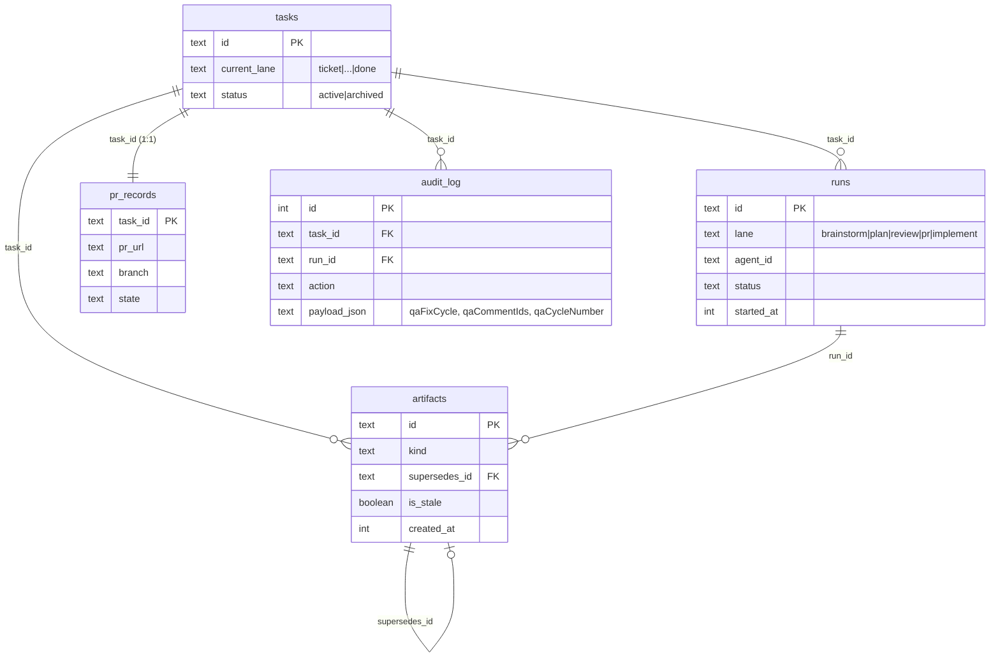

# QA-Failed Fix Loop

## Overview

Today the pipeline terminates at the `done` lane: `ce:work` has run,
the implementation has been pushed to a PR, Jira has been transitioned
to "Code Review", and the card sits idle waiting on humans. When manual
QA rejects the PR — by leaving findings as comments on the Jira ticket
— there is **no in-app affordance to act on those findings**. The
operator's only recourse today is to close the card and start over
(losing brainstorm/plan history) or hand-edit code via the chat panel
(losing the structured pipeline).

This plan adds a **`Fix from QA`** action on `done`-lane cards. The
operator picks the relevant Jira comments via checkbox modal; the
system spawns a fresh `ce:brainstorm` run with those comments as
input, lets the existing auto-advance cascade carry it forward through
Plan → Review, then re-uses the existing manual-approval gates
(Approve & PR → Implement → Approve Implementation) to push the fix
to the same branch and post a tailored "QA fix pushed" Jira comment.
Cycle metadata becomes visible: a `QA fix · N` chip on the card
header, a Run history tab in card detail, and a version dropdown in
`ArtifactViewer` exposing prior brainstorm/plan/review/implementation
versions via the existing `supersedesId` chain.

This is **the smallest end-to-end slice** that solves the problem.
Detection is manual (no polling/webhooks). Same task, same branch,
same PR. No new tables; no migrations.

## Problem Statement

The CE pipeline is opinionated about going forward. It is **silent on
backward motion**:

- **No way to ingest QA feedback.** Jira comments after the PR is
  opened are never surfaced as actionable input. The operator reads
  them in Jira and manually translates findings into prompts via
  chat, defeating the structured pipeline.
- **No record of QA cycles on the card.** A card that has gone
  through three QA loops looks identical on the Board to one that
  passed on first try. Cost, throughput, and stuck-card detection
  treat the two cases the same.
- **Artifact history is in the DB but not in the UI.** Every prior
  brainstorm/plan/review version is preserved via `supersedesId`,
  but `latestArtifactByKind` reduces to a single row per kind. The
  operator who wants to compare "what did the agent think on cycle 1
  vs cycle 2?" has no answer short of querying SQLite.
- **The QA team has no programmatic signal that a fix landed.**
  After a QA-fix push, no Jira comment fires; QA has to notice the
  PR has new commits or get a Slack ping.

## Proposed Solution

Three additive layers, no destructive changes (see brainstorm:
`docs/brainstorms/2026-04-30-qa-failed-fix-loop-brainstorm.md`):

1. **A run-start substrate** that recognises a "QA fix cycle" — a
   run started with `qaFixCycle: true` plus selected Jira comment
   IDs. Detection at finalize/approve time is via audit-log reads
   (parallel to `wasAmendmentRun`); no new columns on `tasks` or
   `runs`.

2. **A new card-detail action** — `Fix from QA` button + Jira-comment
   picker modal. Visible only on `done`-lane, non-archived cards
   with no active run. Owner or admin only (matches `AmendPlanButton`
   permission gate).

3. **Cycle-aware UI gating + history surfacing.** The post-review
   action buttons (`ApproveButton`, `ImplementButton`,
   `ApproveImplementationButton`) get cycle-scoped visibility logic
   so they re-appear on each cycle. A new `QaCycleChip`, a `Run
   history` tab in `CardMainTabs`, and an artifact-version dropdown
   in `ArtifactViewer` make the loop visible.

The runtime split:

- `approveAndPr` keeps current behaviour for first-time approvals; a
  parallel `approveQaFix(taskId)` handles cycle re-pushes (rewrites
  artifact MDs, commits, pushes, **skips** the "PR opened" Jira
  comment, sets lane=`pr`).
- `implementComplete` gains a QA-cycle branch (detected via
  `isTaskInQaFixCycle`) that swaps `implementCommentDoc` →
  `qaFixCommentDoc`, skips the Jira "Code Review" status transition
  (already there), and lands the card on `done`.

## Technical Approach

### Architecture

The feature splits into a **read substrate** (cycle-detection
helpers + comments-since-done query), an **input layer** (button +
picker), a **runtime layer** (QA-cycle-aware branches in `startRun` /
`approveQaFix` / `implementComplete`), and a **presentation layer**
(cycle chip, history tab, version dropdown).

Cycle-state detection (the load-bearing concept):

```
isTaskInQaFixCycle(taskId)
  ├─ find most recent audit_log row where:
  │    action = 'run.started_request'
  │    AND task_id = ?
  │    AND payload->>'qaFixCycle' = 'true'
  └─ if exists AND no audit_log row with
       action = 'task.implementation_complete'
       AND task_id = ?
       AND id > <that row's id>
     → true (cycle in progress)
     else → false
```

Cycle counter:

```
qaFixCycleCount(taskId) = count(*) from audit_log
  where task_id = ?
  AND action = 'run.started_request'
  AND payload->>'qaFixCycle' = 'true'
```

Comments-since-done (for the picker modal):

```
commentsSinceDone(taskId, jiraKey)
  ├─ doneAt = max(audit_log.created_at) where
  │    action = 'task.implementation_complete'
  │    AND task_id = ?
  └─ getIssueComments(jiraKey).filter(c => parseISO(c.created) > doneAt)
```

End-to-end interaction graph for one QA cycle:

```
[ Operator clicks "Fix from QA" on done-lane card ]
        ↓
GET /api/tasks/[id]/qa-fix/comments → commentsSinceDone()
[ Modal renders, operator ticks comments, clicks Run ]
        ↓
POST /api/tasks/[id]/qa-fix/start
  body: { qaCommentIds: ["10421", "10422"] }
  ├─ withAuth (admin or owner)
  ├─ assert task.currentLane === "done"
  ├─ assert no run.status='running' for this task
  ├─ assert qaCommentIds ≥ 1, all present in commentsSinceDone()
  └─ startRun({
        lane: "brainstorm", agentId: "ce:brainstorm",
        qaFixCycle: true, qaCommentIds: [...],
        initiator: { userId, kind: "user" }
     })
        ↓
startRun (modified):
  ├─ if qaFixCycle: filter promptContext.jiraComments to qaCommentIds
  ├─ if qaFixCycle: prepend "## QA findings — round N" section
  ├─ audit "run.started_request" with payload.qaFixCycle=true,
  │    payload.qaCommentIds, payload.qaCycleNumber
  └─ spawnAgent ce:brainstorm
        ↓ (run completes)
maybeAutoAdvance → ce:plan (auto-advance child runs do NOT carry
                            qaFixCycle flag — they read cycle state
                            via isTaskInQaFixCycle)
        ↓ (run completes)
maybeAutoAdvance → ce:review
        ↓ (run completes)
[ Cascade halts: nextLane === "pr", autoAdvance returns early ]
        ↓
[ Operator clicks "Approve & PR" — ApproveButton renders in QA-fix
  mode, routes to approveQaFix instead of approveAndPr ]
        ↓
POST /api/tasks/[id]/approve-qa-fix
  └─ approveQaFix(taskId, userId)
       ├─ write latest brainstorm/plan/review.md to worktree
       ├─ git add + commit (one new commit)
       ├─ robustPush (PR auto-updates with new commits)
       ├─ skip gh pr create (PR exists; reuse url from prRecords)
       ├─ skip Jira comment (deferred to implementComplete)
       └─ tasks.currentLane = "pr"
        ↓
[ ImplementButton appears (cycle-scoped gating) ]
[ Operator clicks Implement Interactive ]
        ↓
POST /api/tasks/[id]/runs body: { lane: "implement",
                                   agentId: "ce:work", interactive: true }
  └─ ce:work runs, leaves uncommitted changes
        ↓
[ ApproveImplementationButton appears (cycle-scoped) ]
[ Operator clicks Approve Implementation ]
        ↓
POST /api/tasks/[id]/approve-implementation
  └─ implementComplete (modified):
       ├─ if isTaskInQaFixCycle(taskId):
       │    ├─ robustPush as today
       │    ├─ postQaFixComment (NEW; instead of implementCommentDoc)
       │    ├─ skip transitionIssueToName("Code Review")
       │    ├─ tasks.currentLane = "done"
       │    └─ audit "task.qa_fix_cycle_completed"
       └─ else: existing path
```

### Data model

**No schema migrations.** Every piece of state is either:
- Derived from `audit_log` (cycle detection, count, since-done cutoff)
- Already in `runs` (lane, agent, cost, started_at — for history tab)
- Already in `artifacts` with `supersedesId` chain (for version dropdown)

The only "new persistent state" is the **audit row payload shape** for
the brainstorm run-start when it's a QA cycle:

```json
{
  "action": "run.started_request",
  "payload": {
    "lane": "brainstorm",
    "agentId": "ce:brainstorm",
    "qaFixCycle": true,
    "qaCommentIds": ["10421", "10422"],
    "qaCycleNumber": 1
  }
}
```

`qaCycleNumber` is the count BEFORE this cycle started (`0` for the
first QA fix, `1` for the second, etc.) — stored so we can reconstruct
cycle history without recomputing.

### ERD



### Cycle-detection helpers (the structural primitives)

A new module `server/lib/qaCycle.ts` exposes helpers used by multiple
call sites:

```typescript
// server/lib/qaCycle.ts (NEW)

/** True when the brainstorm run identified by runId was started as
 *  the head of a QA fix cycle. Mirrors `wasAmendmentRun`. */
export function wasQaFixCycleRun(runId: string): boolean

/** True when the task is currently mid-QA-fix-cycle: a brainstorm
 *  run-start with qaFixCycle=true exists since the most recent
 *  task.implementation_complete audit row. */
export function isTaskInQaFixCycle(taskId: string): boolean

/** Number of QA fix cycles started for this task (0 = none). */
export function qaFixCycleCount(taskId: string): number

/** ISO timestamp of the most recent task.implementation_complete
 *  audit row, or null. Used by the picker to filter comments. */
export function lastImplementationCompleteAt(taskId: string): Date | null

/** Start time of the current cycle (most recent qaFixCycle brainstorm,
 *  or task.createdAt if no cycle started yet). Used by cycle-scoped
 *  UI gating predicates. */
export function currentCycleStartedAt(taskId: string): Date
```

### Implementation phases

Total: **7 phases, ~5 days** of focused work. Phases 1, 2, 3, 6 are
mostly independent and can interleave; phases 4 and 5 build on phase
1's primitives.

#### Phase 1: Cycle-detection substrate (Day 1, ~5h)

**Goal:** every downstream change can call the helpers; nothing else
changes.

Files:
- **NEW** `server/lib/qaCycle.ts` — the five helpers above. Each is a
  small Drizzle query against `audit_log`.
- **NEW** `tests/qaCycle.test.ts` — round-trip every helper.

Acceptance:
- [ ] `wasQaFixCycleRun(runId)` returns true iff that run's
  `run.started_request` audit row has `payload.qaFixCycle === true`.
- [ ] `isTaskInQaFixCycle(taskId)` is true between `Fix from QA` and
  the next `task.implementation_complete`.
- [ ] `qaFixCycleCount(taskId)` matches the literal count of
  brainstorm-with-qaFixCycle audit rows.
- [ ] `lastImplementationCompleteAt(taskId)` returns the most recent
  matching audit row's `created_at`, or null.
- [ ] `currentCycleStartedAt(taskId)` returns the most recent QA-cycle
  brainstorm start time, or task.createdAt as fallback.

#### Phase 2: Comment picker + run-start endpoint (Day 1-2, ~6h)

**Goal:** the manual button can spawn a QA-fix brainstorm run end-to-
end at the API level (no UI yet).

Files:
- **NEW** `app/api/tasks/[id]/qa-fix/comments/route.ts` — GET.
  Admin/owner gate. Returns `{ comments: [{id, author, created,
  body}], doneAt: "ISO" | null }` filtered by `commentsSinceDone()`.
  Returns 409 if `currentLane !== "done"`.
- **NEW** `app/api/tasks/[id]/qa-fix/start/route.ts` — POST.
  Admin/owner gate. Body: `{ qaCommentIds: string[] }`. Validates
  task in `done`, no active run, all commentIds present in
  comments-since-done list, ≥ 1 selected. Calls `startRun(...)` with
  `qaFixCycle: true` + `qaCommentIds`.
- `server/worker/startRun.ts` — modify `StartRunParams` to add
  `qaFixCycle?: boolean` and `qaCommentIds?: string[]`. When
  `qaFixCycle === true`:
  - Filter `promptContext.jiraComments` to only those whose `.id`
    appears in `qaCommentIds`.
  - Build a "## QA findings — round N" prologue, prepended to the
    brainstorm prompt via a new helper
    `buildQaFixBrainstormPrompt(ctx, findings, cycleNumber)` parallel
    to `buildAmendPlanPrompt`.
  - Emit `run.started_request` with `qaFixCycle: true`,
    `qaCommentIds`, `qaCycleNumber`.
- `server/agents/registry.ts` — new exported
  `buildQaFixBrainstormPrompt(ctx, findings, cycleNumber)`.
- **NEW** `tests/qaFixStart.test.ts`.

Acceptance:
- [ ] GET endpoint returns comments after most recent
  `task.implementation_complete`. Returns `[]` if Jira creds missing.
- [ ] POST starts a ce:brainstorm run with the selected comments
  filtered into prompt context under `## QA findings — round N`.
- [ ] POST returns 400 when `qaCommentIds.length === 0`,
  `currentLane !== "done"`, or any commentId not in comments-since-
  done set.
- [ ] POST returns 409 when a run is already active.
- [ ] auto-advance still cascades brainstorm → plan → review.
- [ ] auto-advanced child runs (plan, review) do NOT get
  `qaFixCycle: true` on their own audit rows.

#### Phase 3: Fix from QA button + comment picker modal + cycle chip (Day 2-3, ~7h)

**Goal:** operator-facing UI.

Files:
- **NEW** `components/card-detail/FixFromQaButton.tsx` — visible iff
  `currentLane === "done"`, `status === "active"`, no run with
  `status === "running"`, operator is owner or admin.
- **NEW** `components/card-detail/QaCommentPickerModal.tsx`:
  - On open, fetch GET endpoint. Spinner / error banner.
  - Render checkbox-per-comment list; truncate body to 200 chars
    with expand.
  - At least 1 checkbox required to enable Run Fix button.
  - Submit → POST start endpoint. On success: `router.refresh()` +
    close + toast. On error: keep selections, show banner.
  - "No comments since done" empty state with Refresh button.
- **NEW** `components/card-detail/QaCycleChip.tsx` — `QA fix · N`
  when `qaFixCycleCount >= 1`. Hidden otherwise. Tooltip points to
  Run history tab.
- `app/cards/[id]/page.tsx` — wire button into header action area
  alongside `AmendPlanButton`. Add `QaCycleChip` next to the lane
  chip.

Acceptance:
- [ ] On `currentLane="done"` cards, button is visible.
- [ ] On other lanes or archived, button is hidden.
- [ ] Modal lists exactly the comments the GET endpoint returned;
  selection required.
- [ ] Submit redirects/refreshes; new ce:brainstorm appears in run
  log SSE within ~5s.
- [ ] After cycle starts, `QA fix · 1` chip appears.

#### Phase 4: Cycle-aware UI gating + Run history tab (Day 3-4, ~7h)

**Goal:** when the cascade reaches each manual gate on a re-cycle,
the right buttons appear.

The current gating on `app/cards/[id]/page.tsx`:
```
implementStarted = allRuns.some(r => r.lane === "implement"
                                     && (running|awaiting_input|completed))
```
…is sticky once any implement run lands. Swap to **cycle-scoped**:
only count implement runs whose `started_at` is after
`currentCycleStartedAt(taskId)`. Same fix for
`awaitingImplementationApproval` and `implementationFinalised`.

Files:
- `app/cards/[id]/page.tsx`:
  - Compute `cycleStart = currentCycleStartedAt(task.id)`.
  - Cycle-scope `implementStarted` (`r.startedAt >= cycleStart`).
  - Cycle-scope `awaitingImplementationApproval` and
    `implementationFinalised` (audit row created_at filter).
  - Pass `qaFixCycleCount`, `cycleStart`, `inQaFixCycle` into the
    page so chip + history + ApproveButton can render correctly.
- `components/card-detail/ApproveButton.tsx` — accept new prop
  `inQaFixCycle: boolean`. When true:
  - POST `/api/tasks/[id]/approve-qa-fix` instead of `/approve`.
  - Label becomes `Push QA fix to PR` instead of `Approve & PR`.
  - Visibility based on artifact-not-stale + `currentLane === "review"`,
    independent of `prRecords.state` (fixes the sticky-state issue).
- `components/card-detail/CardMainTabs.tsx` — add `Run history` tab.
- **NEW** `components/card-detail/RunHistoryList.tsx` — chronological
  list of every run grouped by cycle (visual divider when cycle
  increments). Source: existing `allRuns` array.

Acceptance:
- [ ] After cycle 2 brainstorm finishes and lane is `review`, the
  Approve button is visible (not sticky-hidden).
- [ ] After cycle-2 ce:work completes, ImplementButton hides
  (cycle-2 run exists), ApproveImplementationButton appears.
- [ ] Run history tab shows 8 rows after one QA cycle, grouped under
  cycle headers.

#### Phase 5: approveQaFix + implementComplete branch + postQaFixComment (Day 4-5, ~7h)

**Goal:** Approve & PR and Approve Implementation do the right thing
on a QA cycle.

Files:
- **NEW** `server/git/approveQaFix.ts` — `approveQaFix(taskId,
  actorUserId)`. Modeled on `approveAndPr` but:
  - Always re-runs drafting/committed/pushed (no `prRecords.state`
    idempotency). Reads `pr_records` for the PR URL but doesn't
    write state.
  - Skips `gh pr create`; uses `gh pr list --head <branch>` and
    re-uses URL.
  - **Skips** the Jira comment step entirely (deferred to
    implementComplete).
  - Sets `tasks.currentLane = "pr"`.
  - Audits `approve.qa_fix_completed` with cycleNumber.
- **NEW** `app/api/tasks/[id]/approve-qa-fix/route.ts` — POST,
  admin/owner, calls `approveQaFix` inside
  `withRunLock("approve:${taskId}", ...)`.
- **NEW** `server/jira/qaFixComment.ts` — `postQaFixComment(runId,
  taskId, cycleNumber)`. Mirrors `postAmendmentComment` shape:
  - Reads latest brainstorm/plan/review/implementation artifacts.
  - Composes ADF: `### QA fix pushed — round N`, the QA findings
    bulleted (read from brainstorm run-start audit row's
    `qaCommentIds`), one-line summary of what changed (extracted
    from latest implementation artifact), PR URL.
  - `postComment(jiraKey, body)`; audit
    `jira.qa_fix_comment_posted` or `jira.qa_fix_comment_failed`.
- `server/git/implementComplete.ts` — branch on
  `isTaskInQaFixCycle(taskId)`:
  - Step 1 (`safety_push`): unchanged.
  - Step 2 (`implementation_comment`): if QA cycle,
    `postQaFixComment` instead of `postComment(implementCommentDoc)`.
  - Step 3 (`code_review_transition`): if QA cycle, skip and audit
    `jira.transition_skipped` with reason
    `"qa_cycle_already_in_review"`.
  - Step 4 (`lane_to_done`): unchanged. Audit
    `task.qa_fix_cycle_completed` with cycleNumber.
- **NEW** `tests/qaFixApprove.test.ts`,
  `tests/implementCompleteQaCycle.test.ts`.

Acceptance:
- [ ] On QA cycle, Approve & PR rewrites the artifact files,
  creates one new commit, pushes; no Jira comment posted.
- [ ] On QA cycle, Approve Implementation pushes ce:work commits
  and posts the QA-fix comment.
- [ ] Jira "Code Review" transition skipped on QA cycles (audit row
  reflects skip).
- [ ] Non-QA flows behave exactly as before — regression tests
  green.

#### Phase 6: Artifact version dropdown (Day 4-5, ~5h)

**Goal:** operator can view brainstorm v1, v2, v3, … via a dropdown.

Files:
- `app/cards/[id]/page.tsx` — replace `latestArtifactByKind` reducer
  with a per-kind grouped map. Each kind gets all versions, newest
  first.
- `components/card-detail/ArtifactViewer.tsx` — accept `versions:
  Array<{id, filename, markdown, isStale, createdAt, runId, version:
  number}>`. Default selected = latest. HeroUI `Select` above the
  body when `versions.length > 1`, options
  `v3 (latest)`/`v2`/`v1`.
- `components/card-detail/CardMainTabs.tsx` — pass through
  per-kind versions array.

Acceptance:
- [ ] Card with one cycle: no dropdown.
- [ ] After QA cycle 1's brainstorm, dropdown shows `v2 (latest)`/
  `v1`; selecting v1 shows original brainstorm.
- [ ] After cycle 2: `v3 (latest)`/`v2`/`v1`.
- [ ] On-disk file shows latest only (verified by reading worktree).

#### Phase 7: Worktree revival + smoke + docs (Day 5, ~4h)

**Goal:** robust to long-stale `done` cards; documented.

Files:
- `server/git/worktree.ts` — verify `ensureWorktree` handles
  "row says live, path missing" (audit + recreate) and
  "status='pruned'" (recreate from PR branch via `git fetch origin
  <branch> && git worktree add ...`).
- **NEW** `scripts/smoke-qa-fix.sh` — fresh DB → original cycle to
  `done` → simulate Jira comment → Fix from QA → cascade →
  approve-qa-fix → implement → approve-implementation → assert
  second commit on PR + Jira QA-fix comment.
- **NEW** `docs/runbooks/qa-failed-fix-cycle.md` — operator runbook.
- `README.md` — Pages section: mention `Fix from QA`.
- `docs/install-checklist.md` — mention under post-setup verification.

Acceptance:
- [ ] Fix from QA on a card whose worktree was orphan-pruned
  succeeds (recreated, audit row notes revival).
- [ ] Smoke script passes.
- [ ] Docs updated.

## Alternative Approaches Considered

### A. Manual button + audit-log cycle detection (CHOSEN)

- Mirrors `AmendPlanButton` / `wasAmendmentRun` shape.
- No DB migrations.
- Operator-curated comment selection keeps prompt clean.
- Two operator clicks per cycle (Fix from QA + Approve & PR + Approve
  Implementation), matching existing UX.
- **Why chosen:** matches brainstorm decisions exactly.

### B. Background poller for "FAILED QA" comment markers (deferred)

- Cron polls Jira on `done`-lane cards, pattern-matches markers,
  auto-spawns the cycle.
- **Skipped:** no signal that operators want full automation; manual
  is faster to ship and keeps human judgement.
- Re-introducible later as a layer on top of v1.

### C. Jira webhook (deferred)

- **Skipped:** infra cost (public endpoint, secrets, signature
  verification) wildly disproportionate to the value over a button.

### D. Short-circuit re-implement (skip brainstorm/plan/review)

- "Fix from QA" goes straight to `ce:work`. Faster but less rigorous.
- **Skipped:** user explicitly chose full re-flow during brainstorm.

### E. New dedicated lane (`qa-fix`) inserted between `done` and a new terminal

- Adds visible cycle structure on the Board.
- **Skipped:** requires DB migration, conflicts with the
  customizable-workflow branch's lane schema, and the chip surfaces
  the same signal at much lower cost.

### F. Reset prRecords.state to 'drafting' on cycle start, reuse approveAndPr

- Single-function path.
- **Skipped:** approveAndPr always posts the "PR opened" Jira
  comment, which would be noise on a QA cycle. Cleanest path is a
  parallel `approveQaFix` that omits that step.

## System-Wide Impact

### Interaction Graph

(See full graph in Architecture above.)

The cycle-detection helpers are read at three moments:
- Page render: `currentCycleStartedAt`, `qaFixCycleCount`,
  `isTaskInQaFixCycle` to drive UI gating.
- API endpoints: `qa-fix/start` (validates), `approve-qa-fix`
  (implicit via routing).
- `implementComplete`: branches on `isTaskInQaFixCycle`.

Cycle state is **derived from audit_log only** — no `tasks` columns
added. The `task.implementation_complete` row that fires inside
`implementComplete`'s lane-update transaction is the cycle-close
marker; both writes (audit + lane update) commit atomically, so the
next read sees consistent state.

### Error & Failure Propagation

| Failure | Where | Behaviour |
|---|---|---|
| Jira API down on comment fetch | `qa-fix/comments` GET | 503 to client; modal shows "Jira unreachable" with Retry |
| Operator picks comment IDs that aren't in fresh list | `qa-fix/start` POST | 400 `comment_not_found`; modal re-fetches |
| `startRun` fails mid-launch (worktree provision) | spawnAgent constructor | Exception → 500; no audit beyond `run.started_request`; UI shows cycle is open until next `implementation_complete` |
| `ce:brainstorm` fails / cost-killed | spawnAgent.finalize | autoAdvance NOT triggered. Card sits on `brainstorm` with failed run. Operator clicks Run again on Brainstorm. **No automatic recovery in v1.** Cycle stays open. |
| `approveQaFix` fails at git push | API route | 500 → toast; lane stays at `review`. Re-attempts idempotent (file/commit/push level) |
| `postQaFixComment` fails (Jira API down) | implementComplete step 2 | Match existing behaviour: warn-log + audit, lane DOES NOT transition (returns `failedAt: "implementation_comment"`). Operator clicks Approve Implementation again to retry. |
| Two operators race to click Fix from QA | `qa-fix/start` POST | `runActive` server check returns 409 |
| Worktree pruned >24h after `done` | `qa-fix/start` → startRun → ensureWorktree | `ensureWorktree` recreates from origin via `git fetch + worktree add` |
| Operator picks 0 comments | `qa-fix/start` POST | 400 `at_least_one_comment_required`; UI disables button until ≥1 |

### State Lifecycle Risks

| Scenario | Behaviour |
|---|---|
| Cycle started, brainstorm fails, operator abandons | `isTaskInQaFixCycle` stays true forever. Documented in runbook; admin SQL escape hatch (delete the `qaFixCycle` audit row, or insert a `task.qa_fix_cycle_aborted` row that closes the cycle). v2: a "Cancel cycle" button. |
| Cycle completes, second cycle started | First closed by `task.implementation_complete`; second opens via new `run.started_request`. Helpers correctly count 2. |
| Admin archives mid-cycle | Card disappears from boards. Cycle audit rows persist. Acceptable — archive is a clean reset. |
| Two implement runs in cycle 2 (operator retried after failure) | Both runs after `currentCycleStartedAt`. Cycle-scoped `implementStarted` sees both. `awaitingImplementationApproval` gated on most-recent run's status (already the case today). |

### API Surface Parity

| Surface | Today | After this plan |
|---|---|---|
| `GET /api/tasks/[id]/qa-fix/comments` | does not exist | NEW |
| `POST /api/tasks/[id]/qa-fix/start` | does not exist | NEW |
| `POST /api/tasks/[id]/approve-qa-fix` | does not exist | NEW |
| `POST /api/tasks/[id]/approve` | unchanged | unchanged for non-QA flows; UI routes to QA-fix endpoint when in cycle |
| `POST /api/tasks/[id]/approve-implementation` | unchanged signature | internal branch on `isTaskInQaFixCycle` |
| `POST /api/tasks/[id]/runs` | accepts `lane`, `agentId`, `amendFromReview`, `interactive`, `additionalPrompt` | adds `qaFixCycle?` and `qaCommentIds?` |
| `startRun` (server) | reads all Jira comments → all in prompt | when `qaFixCycle: true`, filters to selected IDs only |
| Card-detail page query | `latestArtifactByKind` reducer | per-kind `versions` array (full history) |
| Audit log shape | `run.started_request` payload | adds `qaFixCycle`, `qaCommentIds`, `qaCycleNumber` keys |

### Integration Test Scenarios

`tests/qaFixIntegration.test.ts`:

1. **Full happy path.** Card on `done`. POST `qa-fix/start` with one
   comment ID. Wait for cascade. Mock-trigger approveQaFix → ce:work
   completion → implementComplete. Assert: lane back to `done`,
   second commit on PR (mocked git), Jira got `postQaFixComment`,
   cycle count is 1.

2. **Cycle-scoped UI gating across two cycles.** Run cycle 1 to
   `done`. Run cycle 2 to `done`. At each step verify the right
   buttons are visible.

3. **Comment filtering.** Insert 5 mocked Jira comments with varying
   timestamps spanning before/after the `done` transition. POST
   `qa-fix/start` with 2 of the 3 valid IDs. Assert `startRun`'s
   prompt context contains only those 2 under `## QA findings`.

4. **Failure recovery.** Start a QA cycle. Simulate `ce:brainstorm`
   failing. Card stays on `brainstorm`, `isTaskInQaFixCycle` true,
   button reflects "Run brainstorm" for retry. Re-run brainstorm via
   `RunStarter`. Cascade resumes. Cycle count remains 1.

5. **Validation rejection.** POST `qa-fix/start` from non-`done` →
   409. POST with 0 comments → 400. POST when another run active →
   409. POST with commentId not in comments-since-done → 400.

## Acceptance Criteria

### Functional Requirements

- [ ] On `currentLane === "done"`, `status === "active"` cards,
  owner/admin sees `Fix from QA` action button.
- [ ] Clicking opens modal listing comments after most recent
  `task.implementation_complete` audit row.
- [ ] Selecting ≥ 1 and clicking Run starts a fresh `ce:brainstorm`
  with selected comments under `## QA findings — round N` and
  `qaFixCycle: true` in audit log.
- [ ] Auto-advance carries cascade through Plan and Review.
- [ ] When cascade halts at `review`, Approve & PR re-appears
  (cycle-scoped) and routes to `approveQaFix`. No Jira comment posted.
- [ ] When `ce:work` completes, Approve Implementation re-appears
  (cycle-scoped). Triggers `implementComplete` QA-cycle branch:
  pushes commits, posts `postQaFixComment`, skips Code Review
  transition, lane → `done`.
- [ ] Card header shows `QA fix · N` chip when `qaFixCycleCount >= 1`.
- [ ] `Run history` tab lists every prior run grouped by cycle.
- [ ] `ArtifactViewer` shows version dropdown when kind has > 1
  version.
- [ ] Flow works on cards whose worktree was orphan-pruned.

### Non-Functional Requirements

- [ ] 1-2 audit-log queries per page render (~1ms each on indexed
  task slice).
- [ ] No new external dependencies.
- [ ] No DB migrations.
- [ ] No breaking changes to existing endpoints.
- [ ] Bundle size ~7KB gzipped on card-detail route.
- [ ] Compatible with the in-progress customizable-workflow branch
  (rails unchanged; helpers don't depend on workflow editor).

### Quality Gates

- [ ] All existing vitest tests still green.
- [ ] At least 14 new tests across cycle helpers, comment-filtering,
  qa-fix start validation, prompt context filtering, approveQaFix
  paths, implementComplete QA branch, version dropdown, Run history,
  full integration scenarios.
- [ ] `npm run typecheck`, `npm run lint`, `npm run build` clean.
- [ ] Smoke test passes end-to-end on fresh DB.
- [ ] README, install checklist, runbook updated.

## Success Metrics

- **Adoption:** within 30 days, ≥ 1 task on production has
  `qaFixCycleCount > 0`. Query: `SELECT count(DISTINCT task_id) FROM
  audit_log WHERE action='run.started_request' AND payload_json LIKE
  '%"qaFixCycle":true%'`.
- **Self-service:** zero "how do I re-run after QA found a bug?"
  questions to engineering.
- **Reliability:** zero `task.qa_fix_cycle_completed` rows followed
  by manual SQL fix.
- **No regressions:** pipeline metrics (cost-per-task, time-to-PR,
  failure rate) unchanged on non-QA-cycle tasks at +30 days.

## Dependencies & Prerequisites

**External:** none new.

**Internal:**
- `audit_log` with `payload_json` and indexed `(task_id, action)` —
  shipped.
- `runs.started_at` for cycle-scoped queries — shipped.
- `artifacts.supersedes_id` chain — shipped, just not surfaced.
- `withRunLock` advisory lock — already used by approve.
- `withAuth` admin/owner gate — established by `AmendPlanButton`.
- HeroUI `Select`, `Checkbox`, modal patterns — used elsewhere.

**Blocking:** none.

## Risk Analysis & Mitigation

| # | Risk | Mitigation | Phase |
|---|---|---|---|
| 1 | Cycle never closes (brainstorm fails, operator abandons). `isTaskInQaFixCycle` stays true forever. | v1: documented; admin SQL escape hatch. v2: a "Cancel cycle" button. | Future |
| 2 | `prRecords.state` sticky on Approve & PR re-call — `approveAndPr` is idempotent-by-state and would skip all steps when state='jira_notified'. | Solved by parallel `approveQaFix` — never reads or writes `state` column. | Phase 5 |
| 3 | Cycle-scoped UI gating wrong (button hides when shouldn't or vice versa). | `currentCycleStartedAt` is single source of truth; integration test #2 walks through both cycles. | Phase 4 |
| 4 | Two operators race on Fix from QA. | Server-side `runActive` check; `withRunLock` on approve-qa-fix. Idempotency parallel to `startRun`'s 10s window. | Phases 2, 5 |
| 5 | `ensureWorktree` doesn't handle "row exists, path missing" cleanly. | Phase 7 explicitly verifies + adds recovery; audit row on revival. | Phase 7 |
| 6 | `postQaFixComment` failure blocks lane-to-done (matching existing semantics). | Decision: match existing behaviour — comment is required to close the cycle. Operator retries. Documented in runbook. Alternative (best-effort + warn) rejected because QA needs the comment as re-test signal. | Phase 5 |
| 7 | Comment filtering is plaintext-only — screenshots dropped. | Documented as out-of-scope; v2 adds attachment URL extraction. | Future |
| 8 | `startRun`'s 10s idempotency window blocks auto-advance from QA cycle's brainstorm to plan. | Already passes `bypassIdempotency: true` (autoAdvance.ts:50-52). No change. | (verified) |
| 9 | AGENT_OVERRIDES + cycle-scoped costs — cycles N>1 stack runs and could hit caps faster. | v1: per-run caps continue. Cumulative-per-task warning is v2. | Future |
| 10 | Ordering bug: implementComplete reads `isTaskInQaFixCycle` before moving lane to done; audit lag could cause double-fire. | The `task.implementation_complete` audit + lane update commit atomically inside one `db.transaction`. Verified by integration test. | Phase 5 |
| 11 | HeroUI Modal not yet used in card-detail surface. May conflict with SSE-streaming page. | Phase 3 prototypes; if conflict, fallback to inline expandable panel below action area. | Phase 3 |
| 12 | Auto-advance child runs (plan, review) running with `qaFixCycle` flag — must NOT propagate flag onto own audit rows but must read cycle state for prompt context. | `startRun`: flags only honoured when explicitly passed; `auto_advance` initiator never sets them. Plan/review get QA findings via `priorArtifacts` (the brainstorm output). | Phase 2 |

## Resource Requirements

**Engineering:** ~5 days of focused single-engineer work.
- Day 1: Phase 1 + start of Phase 2
- Day 2: Finish Phase 2 + Phase 3
- Day 3: Phase 3 finishing + Phase 4
- Day 4: Phase 5 + start Phase 6
- Day 5: Phase 6 + Phase 7

**Testing:** ~1 day of the 5-day budget.

**Documentation:** ~3 hours (folded into Phase 7).

**Infra:** none.

## Future Considerations

**v2 path:**
- Auto-detection: Jira-comment poller, webhook, or status-watcher.
  Same `qa-fix/start` endpoint.
- "Cancel QA fix cycle" button (closes via
  `task.qa_fix_cycle_aborted` audit row).
- Per-task cumulative cost meter on dashboard.
- Side-by-side artifact diff (option #4 from brainstorm).
- Image / attachment extraction for ce:brainstorm `WebFetch`.
- QA-cycle hard limit / circuit breaker (warn at cycle 5).
- Free-form operator note alongside selected comments.
- Filter Run history tab by lane / status / cost.

**Compatibility with customizable-workflow branch:**
Cycle helpers read `audit_log` (workflow-agnostic) and
`tasks.current_lane`. The QA-fix flow triggers from the `done` rail,
which is fixed in the workflow design. Only file touched by both is
`app/cards/[id]/page.tsx`; merge should be mechanical.

## Documentation Plan

| Doc | Change |
|---|---|
| `README.md` | Add `Fix from QA` to Pages → Card detail actions |
| `docs/install-checklist.md` | Mention in step 6 (post-setup verification) |
| `docs/runbooks/qa-failed-fix-cycle.md` (NEW) | Step-by-step: button usage, recovery from stuck cycle, abandonment |
| `docs/brainstorms/2026-04-30-qa-failed-fix-loop-brainstorm.md` | Add "Resolved in plan" link once shipped |
| Code comment in `server/lib/qaCycle.ts` | Explain audit-log-derived state model |
| Code comment in `server/git/approveQaFix.ts` | Explain why parallel function not flag |

## Sources & References

### Origin

- **Brainstorm:** [docs/brainstorms/2026-04-30-qa-failed-fix-loop-brainstorm.md](../brainstorms/2026-04-30-qa-failed-fix-loop-brainstorm.md). Key decisions carried forward:
  - Manual `Fix from QA` button on `done`-lane cards
  - Full re-flow brainstorm → plan → review → implement (Review stays in)
  - Operator picks comments via checkbox modal
  - Same task, same branch, same PR
  - Iteration counter chip + run history tab + version dropdown (no diffs)
  - Two human gates per cycle

### Internal references

- AmendPlan precedent: `components/card-detail/AmendPlanButton.tsx`,
  `server/jira/amendComment.ts:120` (`wasAmendmentRun`),
  `server/jira/amendComment.ts:26` (`postAmendmentComment`).
- Run-start substrate: `server/worker/startRun.ts:29-67`
  (`StartRunParams`), `:144-176` (prompt build),
  `:235-247` (audit row).
- Auto-advance: `server/worker/autoAdvance.ts:9-17` (NEXT map),
  `:50` (`bypassIdempotency`).
- Approve flow: `server/git/approve.ts:50` (`approveAndPr`),
  `:65-71` (staleness check), `:99-244` (5-step state machine we
  deliberately do NOT reuse).
- Implement-complete: `server/git/implementComplete.ts:47`,
  `:245-256` (lane→done + cycle-close audit).
- spawnAgent finalize Jira hooks:
  `server/worker/spawnAgent.ts:419-446` (mirror this shape inside
  implementComplete for QA cycles).
- Card-detail page query: `app/cards/[id]/page.tsx:144-181`
  (`latestArtifactByKind` reducer to swap), `:252-296` (action area).
- ImplementButton gating:
  `components/card-detail/ImplementButton.tsx:9-44` (sticky
  predicate to cycle-scope).
- Artifact persistence: `server/worker/persistArtifacts.ts:127-191`
  (`upsertArtifact` supersedesId chain).
- Comment fetching: `server/jira/client.ts:166`
  (`getIssueComments`).
- ADF helpers: `server/jira/adf.ts`.
- Audit log shape: `server/auth/audit.ts`,
  `amendComment.ts:120-136` for payload_json reading patterns.
- Worktree provisioning: `server/git/worktree.ts` (`ensureWorktree`).

### External references

- None new. All Jira REST endpoints already wired.

### Related work

- Brainstorm: [docs/brainstorms/2026-04-30-qa-failed-fix-loop-brainstorm.md](../brainstorms/2026-04-30-qa-failed-fix-loop-brainstorm.md)
- Closest existing analog (AmendPlan): the Review-verdict-driven
  re-plan flow shipped in
  `docs/plans/2026-04-20-feat-nextjs-agent-swimlanes-orchestration-plan.md`.
- Customizable workflow v1 (deferred branch):
  `docs/plans/2026-04-24-feat-customizable-workflow-v1-plan.md`.
  No dependency in either direction.
